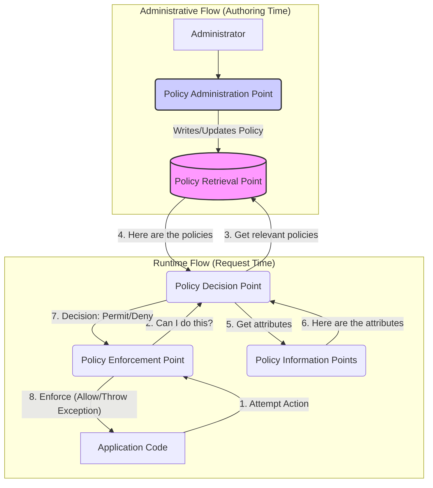
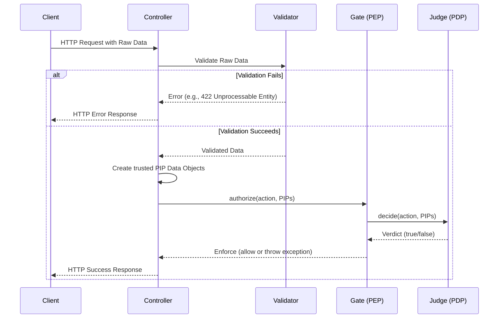
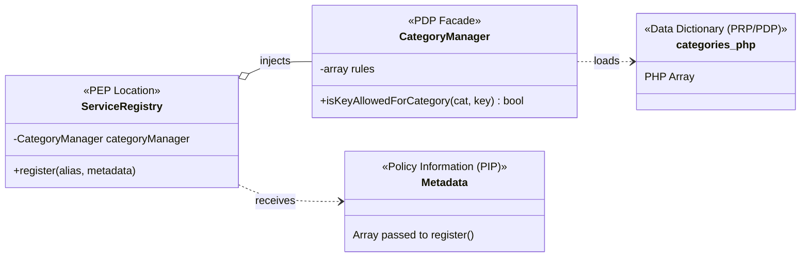

# ABAC Architecture

This document summarizes the architectural concepts of a full Attribute-Based Access Control (ABAC) system, including the five core components as defined by the XACML standard.

## 1. The 5 Components of a Full ABAC System

A complete ABAC architecture includes three runtime components (PEP, PDP, PIP) and two administrative components (PAP, PRP).

1.  **PEP (Policy Enforcement Point):** The "Bouncer."
    *   **Job:** Guards a resource or action, triggers the authorization check, and enforces the final decision (e.g., by allowing the action or throwing an exception).
    *   *Analogy:* The bouncer at a club who stops a guest and asks the manager for a decision.

2.  **PIP (Policy Information Point):** The "Evidence."
    *   **Job:** Provides the attributes of the actor, subject, and environment needed to make a decision.
    *   *Analogy:* The guest's ID, their membership card, and the current time.

3.  **PDP (Policy Decision Point):** The "Brain."
    *   **Job:** Evaluates the evidence from the PIPs against the relevant policies from the PRP to make a "Permit" or "Deny" decision.
    *   *Analogy:* The club manager who looks at the guest's info and the club's rules to make a decision.

4.  **PRP (Policy Retrieval Point):** The "Filing Cabinet."
    *   **Job:** The storage for policies. The PDP queries the PRP to find the correct policy for a given decision.
    *   *Analogy:* The binder where the club's rules are written down.

5.  **PAP (Policy Administration Point):** The "Policy Editor."
    *   **Job:** The tool or interface used to create, manage, and deploy policies into the PRP.
    *   *Analogy:* The word processor the club owner uses to write and print the rules for the binder.

## 2. How They All Interact

There are two distinct flows: the **Administrative Flow** (managing policies at authoring time) and the **Runtime Flow** (checking permissions at request time).



## 3. Concrete Examples in a Laravel-like Framework

This table provides a single source of truth for mapping the formal components to concrete examples in a typical PHP web framework.

| Component | Formal Name | Concrete Example |
| :--- | :--- | :--- |
| **PAP** | Policy Administration Point | The `php artisan make:policy` command. |
| **PRP** | Policy Retrieval Point | The `app/Policies/` directory and the `AuthServiceProvider` that maps models to policies. |
| **PEP** | Policy Enforcement Point | The `authorize()` method in a controller or a `can()` check in a Blade template. |
| **PDP** | Policy Decision Point | The logic inside a specific policy method, like `PostPolicy::update()`. |
| **PIP** | Policy Information Point | The automatically injected `$user` and `$post` objects passed to the policy method. |


## 4. Prerequisite: Input Validation vs. Authorization

Before the ABAC runtime flow even begins, there is a critical prerequisite step: **Input Validation**. It's crucial to understand that Input Validation and Authorization are two separate processes that happen in sequence.

*   **Input Validation** asks: "Is this data's **shape and format correct**?" (e.g., "Is this `email` field a valid email address? Is the `age` an integer?").
*   **Authorization** asks: "Is this user **allowed to perform this action** with this data?"

The purpose of input validation is to convert raw, untrusted data (e.g., from an HTTP request) into the clean, typed, and trusted PIP data objects that the authorization system will use as Evidence.

### The Two-Stage Checkpoint

Think of it as a two-stage security checkpoint at an airport:
1.  **Input Validation:** The check-in agent verifies your passport is filled out correctly and isn't forged. They are validating the data's structure.
2.  **Authorization:** The border agent checks if your valid passport gives you permission to enter the country. They are authorizing an action.

### Workflow Diagram

This sequence diagram shows validation happening first. The authorization flow only begins if validation succeeds.



## 5. Standard vs. Pattern: XACML in PHP

PHP frameworks do **not** implement the formal, heavyweight XACML standard directly. The XML-based nature of the standard is often seen as too cumbersome for most web development.

However, PHP frameworks **absolutely follow the XACML architectural pattern**. The concepts of separating policy, information, and enforcement are fundamental to modern best practices.

For example, Laravel's Gate/Policy system is a pragmatic, developer-friendly implementation of this pattern.

### Example Workflow: Laravel Authorization

Here is the typical end-to-end workflow for defining and using authorization in Laravel to ensure a `User` can only `update` a `Post` that they own.

#### Step 1: Create the Policy Class (PAP & PRP)

You use an artisan command (**PAP**) to generate a Policy class for your `Post` model. This creates a file in `app/Policies` (**PRP**).

```shell
php artisan make:policy PostPolicy --model=Post
```

#### Step 2: Define the Authorization Logic (PDP)

Next, you fill in the logic for the `update` method. This method is your **Policy Decision Point (PDP)**.

**`app/Policies/PostPolicy.php`**
```php
<?php
namespace App\Policies;

use App\Models\Post;
use App\Models\User;

class PostPolicy
{
    /**
     * Determine whether the user can update the model.
     */
    public function update(User $user, Post $post): bool
    {
        // The rule is simple, readable PHP. This is the "decision".
        return $user->id === $post->user_id;
    }
}
```

#### Step 3: Register the Policy (PRP)

You map the `Post` model to the `PostPolicy` in the `AuthServiceProvider`. This enhances the **Policy Retrieval Point (PRP)**, making the policy discoverable.

**`app/Providers/AuthServiceProvider.php`**
```php
<?php
namespace App\Providers;

use App\Models\Post;
use App\Policies\PostPolicy;
use Illuminate\Foundation\Support\Providers\AuthServiceProvider as ServiceProvider;

class AuthServiceProvider extends ServiceProvider
{
    protected $policies = [
        Post::class => PostPolicy::class,
    ];

    public function boot(): void
    {
        $this->registerPolicies();
    }
}
```

#### Step 4: Enforce the Policy in a Controller (PEP)

Finally, in your controller, you call the `authorize` method. This is your **Policy Enforcement Point (PEP)**. The `User` and `Post` models act as **Policy Information Points (PIPs)**.

**`app/Http/Controllers/PostController.php`**
```php
<?php
namespace App\Http\Controllers;

use App\Models\Post;
use Illuminate\Http\Request;

class PostController extends Controller
{
    public function update(Request $request, Post $post)
    {
        // This is the PEP. It will automatically call the PostPolicy.
        $this->authorize('update', $post);

        // This code only runs if authorization passes.
        $post->update($request->all());
        // ...
    }
}
```

## 6. Why This Structure is a Best Practice

Separating these roles is fundamental to good software design:

*   **Single Responsibility Principle (SRP):** Each component does one job, making the system easier to understand and maintain.
*   **Flexibility:** You can change the policy rules (PDP) without ever touching the enforcement logic (PEP). You can change how policies are stored (PRP) without affecting how they are evaluated (PDP).
*   **Testability:** Each component can be unit-tested in isolation.

## 7. OOP Implementation: Dependency Injection

The ideal OOP relationship for these components is **Dependency Injection**. The class containing the PEP (e.g., `ServiceRegistry`) should not create its dependencies. Instead, the PDP facade (e.g., `CategoryManager`) is passed into, or "injected" into, the PEP's class, usually via the constructor.

This is a best practice for several reasons:

1.  **Decoupling:** The `ServiceRegistry` doesn't know *how* the `CategoryManager` gets its rules. It only knows that it has an object that can answer the question "Is this allowed?".
2.  **Testability:** When you unit-test the `ServiceRegistry`, you can easily inject a "mock" `CategoryManager` that returns `true` or `false` on command. This allows you to test the PEP's logic in complete isolation.
3.  **Flexibility:** If you ever change how you store your policies (e.g., moving from a file to a database), you only need to write a new Manager class. The `ServiceRegistry` code doesn't change.

### Simple Schematic of the Interaction

A class diagram is the perfect way to visualize this OOP relationship.



**What this schematic shows:**

1.  **`ServiceRegistry` has a `CategoryManager`:** The solid line with the circle (`o--`) shows that `ServiceRegistry` has a reference to a `CategoryManager` instance. This is the dependency injection.
2.  **`CategoryManager` loads `categories.php`:** The dotted line (`..>`) shows that the `CategoryManager` depends on and loads its rules from the `categories.php` file (the PRP/PDP).
3.  **`ServiceRegistry` receives `Metadata`:** The `ServiceRegistry`'s `register` method receives the metadata array (the PIP) as an argument, which it will then ask the `CategoryManager` to validate.

## 8. Abstract PHP Implementation Contracts

While specific implementations vary, we can define a set of interfaces to represent the abstract roles of PDP, PIP, and PEP. This helps in creating a clean, type-safe, and decoupled authorization system.

### a) The Policy Information Point (PIP)

The PIP is the data being judged. In OOP, these are typically your existing domain models. We can use a marker interface to signify that an object can act as a PIP.

**PHP Interface:**
```php
/**
 * A marker interface indicating that an object can provide
 * information for a policy decision.
 */
interface PolicyInformationPoint {}
```

**Example Implementation:**
```php
class User implements PolicyInformationPoint 
{
    public function __construct(public int $id, public array $roles) {}
}

class Post implements PolicyInformationPoint
{
    public function __construct(public int $authorId) {}
}
```

### b) The Policy Context (A Composite PIP)

For scenarios where an authorization decision involves multiple PIPs (e.g., a user, a post, and a comment) or additional environmental context, passing individual parameters can become cumbersome. The `PolicyContext` class solves this.

It is a **composite PIP** (a Data Transfer Object) that bundles all "Evidence" for a decision into a single, structured object. This simplifies method signatures and improves type-safety, making the authorization logic cleaner and easier to maintain.

A `PolicyContext` typically encapsulates three categories of attributes:
*   **`actor`**: The primary user or system performing the action.
*   **`subjects`**: An array of resources being acted upon (e.g., a `Post`, a `Comment`).
*   **`environment`**: A flexible array for any other contextual attributes that aren't part of the actor or subjects.

**PHP Class:**
```php
<?php
namespace YourVendor\AbacAuth\Contracts;

// PolicyInformationPoint is the marker interface for all evidence
// (This interface is already defined above, included here for context)
// interface PolicyInformationPoint {}

final class PolicyContext implements PolicyInformationPoint
{
    /**
     * @param PolicyInformationPoint $actor The primary actor performing the action.
     * @param array<PolicyInformationPoint> $subjects An array of subjects being acted upon.
     * @param array<string, mixed> $environment Any other relevant environmental context (e.g., IP address, time).
     */
    public function __construct(
        public readonly PolicyInformationPoint $actor,
        public readonly array $subjects = [],
        public readonly array $environment = []
    ) {
        // Optional: Add validation here to ensure all $subjects are PolicyInformationPoint
        foreach ($this->subjects as $subject) {
            if (!$subject instanceof PolicyInformationPoint) {
                throw new \InvalidArgumentException('All subjects must implement PolicyInformationPoint.');
            }
        }
    }

    /**
     * Helper method to retrieve a specific subject by its class type.
     *
     * @template T of PolicyInformationPoint
     * @param class-string<T> $type The class name of the subject to retrieve.
     * @return T|null
     */
    public function getSubjectByType(string $type): ?PolicyInformationPoint
    {
        foreach ($this->subjects as $subject) {
            if ($subject instanceof $type) {
                return $subject;
            }
        }
        return null;
    }
}
```

### c) The Authorization Response (A Richer Verdict)

While returning a simple `boolean` from a policy is straightforward, it's often too limited. It doesn't explain *why* a request was denied. A much more robust pattern is to return a dedicated `AuthorizationResponse` object.

This object acts as a rich "verdict," containing not just the decision but also the reasoning.

**PHP Class:**
```php
<?php
namespace YourVendor\AbacAuth;

final readonly class AuthorizationResponse
{
    private function __construct(
        public bool $allowed,
        public ?string $message = null,
        public ?string $code = null
    ) {}

    public static function allow(): self
    {
        return new self(true);
    }

    public static function deny(?string $message = null, ?string $code = null): self
    {
        return new self(false, $message, $code);
    }
}
```

### d) The Policy Decision Point (PDP)

The PDP contains the actual policy logic. Its interface is updated to return the `AuthorizationResponse` object, providing a much richer verdict than a simple boolean.

**PHP Interface:**
```php
<?php
namespace YourVendor\AbacAuth\Contracts;

use YourVendor\AbacAuth\AuthorizationResponse;

interface PolicyDecisionPoint
{
    /**
     * Decides if an action is permitted based on the given context.
     *
     * @param string $action The action to authorize (e.g., 'edit-post', 'delete-user').
     * @param PolicyContext $context A comprehensive object containing all relevant PIPs (actor, subjects) and environmental data.
     * @return AuthorizationResponse The detailed result of the authorization check.
     */
    public function decide(string $action, PolicyContext $context): AuthorizationResponse;
}
```

### e) The Policy Enforcement Point (PEP)

The PEP is updated to handle the `AuthorizationResponse` object. It now checks the `allowed` property and can use the response message in its exception, providing more meaningful error details.

**Example Implementation:**
```php
use YourVendor\AbacAuth\AuthorizationResponse; // Add this use statement

class AuthorizationGate
{
    public function __construct(private PolicyDecisionPoint $pdp) {}

    /**
     * Checks if an action is allowed. Throws an exception if not.
     * This is the Policy Enforcement Point.
     *
     * @param string $action The action to authorize.
     * @param PolicyContext $context The comprehensive context for the decision.
     * @throws AuthorizationException If the action is not allowed.
     */
    public function authorize(string $action, PolicyContext $context): void
    {
        $response = $this->pdp->decide($action, $context);

        if ($response->allowed === false) {
            throw new AuthorizationException($response->message ?? "Action '{$action}' is not allowed.");
        }
    }
}
```

## 9. The Core Components of an ABAC Decision

While the basic pattern for an authorization check is an **Actor** performing an **Action** on a **Subject**, the real power of ABAC comes from the 'A' and 'B' in its name: **Attribute-Based**.

ABAC makes decisions by evaluating the **attributes** of four distinct components against a policy.

1.  **Actor Attributes:** Who is the user?
    *   *Examples:* `role`, `department`, `age`, `security_clearance`.

2.  **Action:** What are they trying to do?
    *   *Examples:* `edit`, `view`, `delete`, `approve`.

3.  **Subject (or Resource) Attributes:** What is being acted upon?
    *   *Examples:* `status`, `owner_id`, `value`, `sensitivity_level`.

4.  **Environmental Attributes:** What is the context of the request?
    *   *Examples:* `time_of_day`, `IP_address`, `location`, `is_mfa_enabled`.

A simpler Role-Based Access Control (RBAC) system would stop at "is the user a manager?". ABAC goes much deeper, allowing for incredibly rich, context-aware rules by evaluating attributes from all four components.