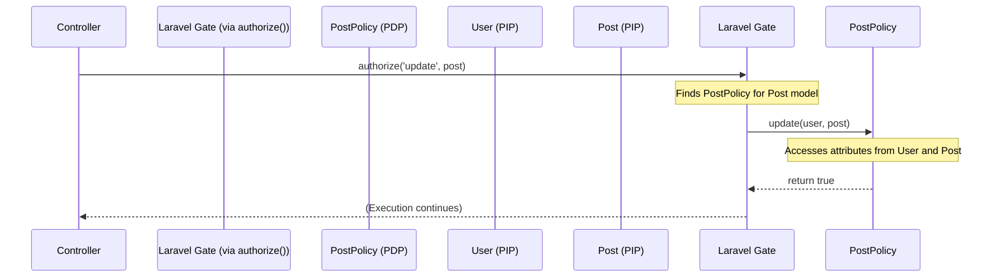

# Reference: Authorization Concepts (PDP, PIP, PEP)

This document summarizes the architectural concepts of the Policy Decision Point (PDP), Policy Information Point (PIP), and Policy Enforcement Point (PEP).

## 1. What are PDP, PIP, and PEP?

These terms, formalized by the XACML standard, describe distinct roles within an authorization system. Understanding their separation is key to building robust applications.

*   **PDP (Policy Decision Point):** The brain of the operation. This is the ultimate source of truth that defines the policy rules. It is the component that makes the final decision.
    *   *Analogy:* The club owner who writes the guest list and the rules (e.g., "no sneakers, members only").
    *   *In Code:* The `PostPolicy` class, the logic inside a `Gate::define()` closure, or your `categories.php` file.

*   **PIP (Policy Information Point):** The source of information needed to make a decision. These are your data objects and application state.
    *   *Analogy:* The guest's ID, their membership card, and their attire.
    *   *In Code:* The currently authenticated `User` object, the `Post` model being evaluated, the current time, the user's IP address.

*   **PEP (Policy Enforcement Point):** The bouncer at the door. This is the component that actually enforces the policy. It guards a resource or action, asks the PDP for a decision, and then acts on that decision.
    *   *Analogy:* The bouncer who checks the ID against the guest list and either opens the rope or denies entry.
    *   *In Code:* An `AuthMiddleware`, the `Gate::allows()` method, or a `can()` check in a controller.

## 2. Prerequisite: Input Validation vs. Authorization

Before the PEP/PDP/PIP pattern even begins, there is a critical prerequisite step: **Input Validation**. It's crucial to understand that Input Validation and Authorization are two separate processes that happen in sequence.

*   **Input Validation** asks: "Is this data's **shape and format correct**?" (e.g., "Is this `email` field a valid email address? Is the `age` an integer?").
*   **Authorization** asks: "Is this user **allowed to perform this action** with this data?"

The purpose of input validation is to convert raw, untrusted data (e.g., from an HTTP request) into the clean, typed, and trusted PIP data objects that the authorization system will use as Evidence.

### The Two-Stage Checkpoint

Think of it as a two-stage security checkpoint at an airport:
1.  **Input Validation:** The check-in agent verifies your passport is filled out correctly and isn't forged. They are validating the data's structure.
2.  **Authorization:** The border agent checks if your valid passport gives you permission to enter the country. They are authorizing an action.

### Workflow Diagram

This sequence diagram shows validation happening first. The authorization flow only begins if validation succeeds.


## 3. Standard vs. Pattern: XACML in PHP

PHP frameworks do **not** implement the formal, heavyweight XACML standard directly. The XML-based nature of the standard is often seen as too cumbersome for most web development.

However, PHP frameworks **absolutely follow the XACML architectural pattern**. The concepts of separating policy, information, and enforcement are fundamental to modern best practices.

For example, Laravel's Gate/Policy system is a pragmatic, developer-friendly implementation of this pattern.

### Example Workflow: Laravel Authorization

Here is the typical end-to-end workflow for defining and using authorization in Laravel to ensure a `User` can only `update` a `Post` that they own.

#### Step 1: Create the Policy Class (PDP)

First, you use an artisan command to generate a Policy class for your `Post` model. This class is your **Policy Decision Point (PDP)**.

```shell
php artisan make:policy PostPolicy --model=Post
```

This creates a `app/Policies/PostPolicy.php` file.

#### Step 2: Define the Authorization Logic

Next, you fill in the logic for the `update` method. This method will receive the current `User` and the `Post` instance as arguments automatically.

**`app/Policies/PostPolicy.php`**
```php
<?php
namespace App\Policies;

use App\Models\Post;
use App\Models\User;

class PostPolicy
{
    /**
     * Determine whether the user can update the model.
     */
    public function update(User $user, Post $post): bool
    {
        // The rule is simple, readable PHP. This is the "decision".
        return $user->id === $post->user_id;
    }
}
```

#### Step 3: Register the Policy

You map the `Post` model to the `PostPolicy` in the `AuthServiceProvider`.

**`app/Providers/AuthServiceProvider.php`**
```php
<?php
namespace App\Providers;

use App\Models\Post;
use App\Policies\PostPolicy;
use Illuminate\Foundation\Support\Providers\AuthServiceProvider as ServiceProvider;

class AuthServiceProvider extends ServiceProvider
{
    protected $policies = [
        Post::class => PostPolicy::class,
    ];

    public function boot(): void
    {
        $this->registerPolicies();
    }
}
```

#### Step 4: Enforce the Policy in a Controller (PEP)

Finally, in your controller, you call the `authorize` method. This is your **Policy Enforcement Point (PEP)**.

**`app/Http/Controllers/PostController.php`**
```php
<?php
namespace App\Http\Controllers;

use App\Models\Post;
use Illuminate\Http\Request;

class PostController extends Controller
{
    public function update(Request $request, Post $post)
    {
        // This is the PEP. It will automatically call the PostPolicy.
        $this->authorize('update', $post);

        // This code only runs if authorization passes.
        $post->update($request->all());
        // ...
    }
}
```

#### The Workflow Behind the Scenes

When `$this->authorize('update', $post)` is called, Laravel performs these steps:

1.  It sees the action `'update'` and the `$post` subject.
2.  It finds the registered `PostPolicy` for the `Post` model.
3.  It calls the `update` method on the `PostPolicy`.
4.  It automatically passes the authenticated `User` and the `$post` as arguments (the **PIPs**).
5.  If the method returns `false`, Laravel throws an `AuthorizationException`, resulting in a 403 Forbidden response.
6.  If `true`, execution continues.

This workflow is illustrated in the following sequence diagram:



## 4. How They Interact: The "Hub and Spoke" Model

The components are **not** implemented in a simple chain. Doing so would create a tightly-coupled system. Instead, they interact in a **hub-and-spoke** model where the **PEP is the central hub**.

This interaction model is a critical best practice because it decouples the components.

1.  An action is attempted in the application (e.g., a controller method).
2.  The application code calls the **PEP** to check for permission.
3.  The **PEP** gathers the necessary data from the **PIPs** (e.g., the current user, the target resource).
4.  The **PEP** consults the **PDP**, passing it the information from the PIPs to get a decision.
5.  The **PDP** evaluates its rules and returns a simple "Permit" or "Deny" decision to the PEP.
6.  The **PEP** enforces the decision, either by letting execution continue or by stopping it (e.g., throwing a 403 exception).

### Interaction Flowchart

This sequence diagram shows the PEP acting as the central orchestrator.


## 5. Why This Structure is a Best Practice

Separating these roles is fundamental to good software design:

*   **Single Responsibility Principle (SRP):** Each component does one job, making the system easier to understand and maintain.
*   **Flexibility:** You can change the policy rules (PDP) without ever touching the enforcement logic (PEP).
*   **Testability:** Each component can be unit-tested in isolation.

## 6. OOP Implementation: Dependency Injection

The ideal OOP relationship for these components is **Dependency Injection**. The class containing the PEP (e.g., `ServiceRegistry`) should not create its dependencies. Instead, the PDP facade (e.g., `CategoryManager`) is passed into, or "injected" into, the PEP's class, usually via the constructor.

This is a best practice for several reasons:

1.  **Decoupling:** The `ServiceRegistry` doesn't know *how* the `CategoryManager` gets its rules. It only knows that it has an object that can answer the question "Is this allowed?".
2.  **Testability:** When you unit-test the `ServiceRegistry`, you can easily inject a "mock" `CategoryManager` that returns `true` or `false` on command. This allows you to test the PEP's logic in complete isolation.
3.  **Flexibility:** If you ever change how you store your policies (e.g., moving from a file to a database), you only need to write a new Manager class. The `ServiceRegistry` code doesn't change.

### Simple Schematic of the Interaction

A class diagram is the perfect way to visualize this OOP relationship.


**What this schematic shows:**

1.  **`ServiceRegistry` has a `CategoryManager`:** The solid line with the circle (`o--`) shows that `ServiceRegistry` has a reference to a `CategoryManager` instance. This is the dependency injection.
2.  **`CategoryManager` loads `categories.php`:** The dotted line (`..>`) shows that the `CategoryManager` depends on and loads its rules from the `categories.php` file (the PDP).
3.  **`ServiceRegistry` receives `Metadata`:** The `ServiceRegistry`'s `register` method receives the metadata array (the PIP) as an argument, which it will then ask the `CategoryManager` to validate.

## 7. Abstract PHP Implementation Contracts

While specific implementations vary, we can define a set of interfaces to represent the abstract roles of PDP, PIP, and PEP. This helps in creating a clean, type-safe, and decoupled authorization system.

### a) The Policy Information Point (PIP)

The PIP is the data being judged. In OOP, these are typically your existing domain models. We can use a marker interface to signify that an object can act as a PIP.

**PHP Interface:**
```php
/**
 * A marker interface indicating that an object can provide
 * information for a policy decision.
 */
interface PolicyInformationPoint {}
```

**Example Implementation:**
```php
class User implements PolicyInformationPoint 
{
    public function __construct(public int $id, public array $roles) {}
}

class Post implements PolicyInformationPoint
{
    public function __construct(public int $authorId) {}
}
```

**Class Diagram:**


### d) The Policy Context (A Composite PIP)

For scenarios where an authorization decision involves multiple PIPs (e.g., a user, a post, and a comment) or additional environmental context, passing individual parameters can become cumbersome. The `PolicyContext` class solves this.

It is a **composite PIP** (a Data Transfer Object) that bundles all "Evidence" for a decision into a single, structured object. This simplifies method signatures and improves type-safety, making the authorization logic cleaner and easier to maintain.

A `PolicyContext` typically encapsulates three categories of attributes:
*   **`actor`**: The primary user or system performing the action.
*   **`subjects`**: An array of resources being acted upon (e.g., a `Post`, a `Comment`).
*   **`environment`**: A flexible array for any other contextual attributes that aren't part of the actor or subjects.

#### The `$environment` Array

The `$environment` array's purpose is to hold information about the **circumstances** of the request. It answers questions like:
*   **Where** is the request from? (e.g., `'ip_address' => '192.168.1.1'`)
*   **When** is it happening? (e.g., `'current_time' => new \DateTimeImmutable()`)
*   **How** is the user authenticated? (e.g., `'mfa_enabled' => true`)

This allows for powerful, granular policies, such as "only allow edits from a specific IP range" or "only allow approvals during business hours."

#### Should the class be `final`?

Yes, it is a best practice to make the `PolicyContext` class `final`. It is a DTO whose sole purpose is to carry data. Making it `final` ensures its structure is stable and cannot be altered through inheritance, which guarantees a predictable and reliable data contract for the policy engine.

**PHP Class:**
```php
<?php
namespace YourVendor\AbacAuth\Contracts;

// PolicyInformationPoint is the marker interface for all evidence
// (This interface is already defined above, included here for context)
// interface PolicyInformationPoint {}

final class PolicyContext implements PolicyInformationPoint
{
    /**
     * @param PolicyInformationPoint $actor The primary actor performing the action.
     * @param array<PolicyInformationPoint> $subjects An array of subjects being acted upon.
     * @param array<string, mixed> $environment Any other relevant environmental context (e.g., IP address, time).
     */
    public function __construct(
        public readonly PolicyInformationPoint $actor,
        public readonly array $subjects = [],
        public readonly array $environment = []
    ) {
        // Optional: Add validation here to ensure all $subjects are PolicyInformationPoint
        foreach ($this->subjects as $subject) {
            if (!$subject instanceof PolicyInformationPoint) {
                throw new \InvalidArgumentException('All subjects must implement PolicyInformationPoint.');
            }
        }
    }

    /**
     * Helper method to retrieve a specific subject by its class type.
     *
     * @template T of PolicyInformationPoint
     * @param class-string<T> $type The class name of the subject to retrieve.
     * @return T|null
     */
    public function getSubjectByType(string $type): ?PolicyInformationPoint
    {
        foreach ($this->subjects as $subject) {
            if ($subject instanceof $type) {
                return $subject;
            }
        }
        return null;
    }
}
```

**Example Usage (Creating the Context):**
```php
// In your Controller or Service
use YourVendor\AbacAuth\Contracts\PolicyContext;
use App\Models\User; // Assuming these are your application's PIPs
use App\Models\Post;
use App\Models\Comment;

$currentUser = new User(id: 123, roles: ['editor']); // PIP
$postToEdit = new Post(id: 456, authorId: 123);     // PIP
$commentToModerate = new Comment(id: 789, postId: 456); // PIP

// Assemble all the evidence into a single PolicyContext object
$context = new PolicyContext(
    actor: $currentUser,
    subjects: [$postToEdit, $commentToModerate],
    environment: ['ip_address' => '192.168.1.1', 'current_time' => new \DateTimeImmutable()]
);
```

### e) The Authorization Response (A Richer Verdict)

While returning a simple `boolean` from a policy is straightforward, it's often too limited. It doesn't explain *why* a request was denied. A much more robust pattern is to return a dedicated `AuthorizationResponse` object.

This object acts as a rich "verdict," containing not just the decision but also the reasoning. It typically includes:
1.  **The Decision:** A boolean (`true` for allow, `false` for deny).
2.  **A Message:** A human-readable string explaining the outcome (e.g., "User must be an admin to delete posts."). This is invaluable for logging and debugging.
3.  **A Code (Optional):** A machine-readable identifier (e.g., `NOT_ADMIN`) for programmatic checks.

**PHP Class:**
```php
<?php
namespace YourVendor\AbacAuth;

final readonly class AuthorizationResponse
{
    private function __construct(
        public bool $allowed,
        public ?string $message = null,
        public ?string $code = null
    ) {}

    public static function allow(): self
    {
        return new self(true);
    }

    public static function deny(?string $message = null, ?string $code = null): self
    {
        return new self(false, $message, $code);
    }
}
```

### b) The Policy Decision Point (PDP)

The PDP contains the actual policy logic. Its interface is updated to return the `AuthorizationResponse` object, providing a much richer verdict than a simple boolean.

**PHP Interface:**
```php
<?php
namespace YourVendor\AbacAuth\Contracts;

use YourVendor\AbacAuth\AuthorizationResponse;

interface PolicyDecisionPoint
{
    /**
     * Decides if an action is permitted based on the given context.
     *
     * @param string $action The action to authorize (e.g., 'edit-post', 'delete-user').
     * @param PolicyContext $context A comprehensive object containing all relevant PIPs (actor, subjects) and environmental data.
     * @return AuthorizationResponse The detailed result of the authorization check.
     */
    public function decide(string $action, PolicyContext $context): AuthorizationResponse;
}
```

**Example Implementation:**
```php
use YourVendor\AbacAuth\Contracts\PolicyContext;
use YourVendor\AbacAuth\AuthorizationResponse;

class BlogPostPolicy implements PolicyDecisionPoint
{
    public function decide(string $action, PolicyContext $context): AuthorizationResponse
    {
        $actor = $context->actor;
        $post = $context->getSubjectByType(Post::class);

        if (!$actor instanceof User || !$post instanceof Post) {
            return AuthorizationResponse::deny('Invalid context provided.');
        }

        return match ($action) {
            'edit-post' => $this->canEdit($actor, $post),
            'delete-post' => $this->canDelete($actor, $post),
            default => AuthorizationResponse::deny("Unknown action: {$action}."),
        };
    }

    private function canEdit(User $actor, Post $post): AuthorizationResponse
    {
        if ($actor->id === $post->authorId || in_array('admin', $actor->roles)) {
            return AuthorizationResponse::allow();
        }
        return AuthorizationResponse::deny('You are not the author of this post.');
    }

    private function canDelete(User $actor, Post $post): AuthorizationResponse
    {
        if (in_array('admin', $actor->roles)) {
            return AuthorizationResponse::allow();
        }
        return AuthorizationResponse::deny('Only administrators can delete posts.');
    }
}
```

### c) The Policy Enforcement Point (PEP)

The PEP is updated to handle the `AuthorizationResponse` object. It now checks the `allowed` property and can use the response message in its exception, providing more meaningful error details.

**Example Implementation:**
```php
use YourVendor\AbacAuth\AuthorizationResponse; // Add this use statement

class AuthorizationGate
{
    public function __construct(private PolicyDecisionPoint $pdp) {}

    /**
     * Checks if an action is allowed. Throws an exception if not.
     * This is the Policy Enforcement Point.
     *
     * @param string $action The action to authorize.
     * @param PolicyContext $context The comprehensive context for the decision.
     * @throws AuthorizationException If the action is not allowed.
     */
    public function authorize(string $action, PolicyContext $context): void
    {
        $response = $this->pdp->decide($action, $context);

        if ($response->allowed === false) {
            throw new AuthorizationException($response->message ?? "Action '{$action}' is not allowed.");
        }
    }
}
```

**Class Diagram (PEP & PDP Relationship):**


## 8. Generic Example: Blog Post Authorization

Here is how all the pieces work together in a generic controller.

```php
// 1. Your services are constructed with dependency injection.
$blogPolicy = new BlogPostPolicy(); // This is our PDP.
$gate = new AuthorizationGate($blogPolicy); // Our PEP, injected with the PDP.

// 2. Your application receives a request.
$currentUser = new User(id: 123, roles: ['editor']); // PIP
$postToEdit = new Post(authorId: 123); // PIP

// 3. The controller uses the PEP to guard an action.
class PostController
{
    public function __construct(private AuthorizationGate $gate) {}

    public function update(User $currentUser, Post $postToEdit, array $newData)
    {
        try {
            // Assemble the PolicyContext (the comprehensive Evidence)
            $context = new PolicyContext(
                actor: $currentUser,
                subjects: [$postToEdit]
            );

            // The PEP is called here with the PolicyContext.
            $this->gate->authorize('edit-post', $context);

            // This code only runs if authorize() does not throw an exception.
            echo "Authorization successful! Updating post...";
            // ... update post logic ...

        } catch (AuthorizationException $e) {
            echo "Caught exception: " . $e->getMessage();
            // Return a 403 Forbidden response.
        }
    }
}

// 4. Running the example.
$controller = new PostController($gate);
$controller->update($currentUser, $postToEdit, ['title' => 'New Title']);
// Output: Authorization successful! Updating post...
```

## 9. Formal Concepts & Naming

The hub-and-spoke architecture we have discussed is an implementation of several formal industry concepts.

### Attribute-Based Access Control (ABAC)

This is the most accurate, industry-standard name for this authorization *strategy*. In an ABAC system, authorization decisions are made by evaluating **attributes** (properties) against a set of policies. This is more flexible than simple Role-Based Access Control (RBAC).

*   **Attributes** are provided by the **PIPs** (e.g., a user's role, a post's status, the current time).
*   **Policies** are defined in the **PDP** (e.g., "Allow users with the 'editor' role to 'edit' a post if the post's status is 'draft'.").
*   The **PEP** gathers the attributes and queries the PDP.

The PDP/PIP/PEP model is the classic architecture for implementing an ABAC system.

### The Mediator Pattern

From a software design pattern perspective, this architecture is a clear example of the **Mediator Pattern**.

The **PEP** acts as the **Mediator**. It manages and coordinates communication between the other components (the Application Code, the PDP, the PIPs). The application code only talks to the Mediator (the PEP), and is completely decoupled from the complex policy logic in the PDP. This reduces direct dependencies and makes the system easier to manage.

## 10. Creating a Reusable ABAC Library

It is an excellent idea and a standard practice to isolate this core logic into a reusable Composer package. This is a form of **Component-Based Development**.

### Package Structure

A minimal, reusable package would have the following structure:

```
/php-abac-auth/
├── composer.json
└── src/
    ├── Contracts/
    │   ├── PolicyDecisionPoint.php
    │   └── PolicyInformationPoint.php
    ├── Gate.php
    └── Exception/
        └── AuthorizationException.php
```

### File Contents

**`composer.json`**
```json
{
    "name": "your-vendor/abac-auth",
    "description": "A simple, reusable library for Attribute-Based Access Control.",
    "type": "library",
    "license": "MIT",
    "autoload": {
        "psr-4": {
            "YourVendor\\AbacAuth\\": "src/"
        }
    },
    "require": {
        "php": ">=8.1"
    }
}
```

**`src/Contracts/PolicyInformationPoint.php`**
```php
<?php
namespace YourVendor\AbacAuth\Contracts;

interface PolicyInformationPoint {}
```

**`src/Contracts/PolicyDecisionPoint.php`**
```php
<?php
namespace YourVendor\AbacAuth\Contracts;

interface PolicyDecisionPoint
{
    public function decide(string $action, PolicyInformationPoint $actor, ?PolicyInformationPoint $subject = null): bool;
}
```

**`src/Gate.php` (The PEP)**

This is the **concrete implementation** of the Policy Enforcement Point. It is not an interface or an abstract class because its core responsibility (orchestrating the decision and enforcing it) is generic and fully implemented.

```php
<?php
namespace YourVendor\AbacAuth;

use YourVendor\AbacAuth\Contracts\PolicyDecisionPoint;
use YourVendor\AbacAuth\Contracts\PolicyInformationPoint;
use YourVendor\AbacAuth\Exception\AuthorizationException;

final class Gate // Recommended to be final
{
    public function __construct(private PolicyDecisionPoint $pdp) {}

    public function authorize(string $action, PolicyInformationPoint $actor, ?PolicyInformationPoint $subject = null): void
    {
        if ($this->pdp->decide($action, $actor, $subject) === false) {
            throw new AuthorizationException("Action '{$action}' is not allowed.");
        }
    }
    // ... other helper methods like allows() / denies() ...
}
```

**Should the `Gate` class be `final`?**

Yes, it is generally **recommended to make the `Gate` class `final`**.

*   **Why `final` is good:**
    *   **Enforces Design Intent:** The `Gate` is designed to be a generic orchestrator whose core behavior should not be altered. Making it `final` prevents developers from extending it and inadvertently changing its fundamental role.
    *   **Ensures Consistency:** It guarantees that the enforcement logic will always behave as intended, regardless of how it's used in an application.
    *   **Improves Testability:** When you know a class cannot be extended, you can test it more confidently, as its behavior is fully encapsulated.
    *   **Allows for Internal Optimizations:** The PHP engine can sometimes make minor optimizations for `final` classes.

*   **Why you might *think* you need to extend it (and why composition is usually better):**
    *   **Adding Logging/Metrics:** If you want to add logging or metrics around authorization calls, it's better to wrap the `Gate` in a decorator or use middleware, rather than extending it.
    *   **Altering Enforcement Behavior:** If you need a fundamentally different way to enforce policies (e.g., not throwing an exception but returning a boolean and a reason), you're likely building a different kind of PEP, and should create a new class that *uses* the `PolicyDecisionPoint` interface, rather than extending this generic `Gate`.

By making the `Gate` `final`, you clearly communicate that it's a complete, ready-to-use component that should be used via **composition** (passing it around and calling its methods), not **inheritance).

**`src/Exception/AuthorizationException.php`**
```php
<?php

namespace YourVendor\AbacAuth\Exception;

use Exception;
use Throwable;

class AuthorizationException extends Exception
{
    public function __construct(
        string $message = "Action is not authorized.",
        int $code = 403,
        ?Throwable $previous = null
    ) {
        parent::__construct($message, $code, $previous);
    }
}

```

### Library vs. Application Code

This diagram shows the clear separation between the generic **Library** and the specific **Application Code** that uses it.


### How to Use the Package

A developer using your library would:

1.  **Implement your library's interfaces** in their own application-specific classes (`User`, `Post`, `AppPolicy`).
2.  **Instantiate their custom PDP** (`$myAppPolicy = new AppPolicy();`).
3.  **Instantiate your library's `Gate` (PEP)**, injecting their custom PDP into it (`$gate = new Gate($myAppPolicy);`).
4.  **Use the `$gate`** in their application to authorize actions.

## 11. The Core Components of an ABAC Decision

While the basic pattern for an authorization check is an **Actor** performing an **Action** on a **Subject**, the real power of ABAC comes from the 'A' and 'B' in its name: **Attribute-Based**.

ABAC makes decisions by evaluating the **attributes** of four distinct components against a policy.

1.  **Actor Attributes:** Who is the user?
    *   *Examples:* `role`, `department`, `age`, `security_clearance`.

2.  **Action:** What are they trying to do?
    *   *Examples:* `edit`, `view`, `delete`, `approve`.

3.  **Subject (or Resource) Attributes:** What is being acted upon?
    *   *Examples:* `status`, `owner_id`, `value`, `sensitivity_level`.

4.  **Environmental Attributes:** What is the context of the request?
    *   *Examples:* `time_of_day`, `IP_address`, `location`, `is_mfa_enabled`.

### Real-World Analogy

Imagine a policy like this:

> Allow a **user** (Actor) to **approve** (Action) a **payment** (Subject), but only if:
>
> *   The user's `role` is 'manager' (**Actor Attribute**)
> *   The payment's `amount` is less than $1,000 (**Subject Attribute**)
> *   The `time_of_day` is during business hours (**Environmental Attribute**)

A simpler Role-Based Access Control (RBAC) system would stop at "is the user a manager?". ABAC goes much deeper, allowing for incredibly rich, context-aware rules by evaluating attributes from all four components.

In summary, while ABAC is perfectly suited for "Actor, Action, Subject" scenarios, its true strength lies in making highly granular, context-aware decisions based on the *attributes* of all those components, plus the environment.


## 12. Practical Example: Modeling Metadata Validation

Here is how you would typically model the authorization of a metadata property (like a `category` or `type`) using the ABAC components.

### Scenario

A developer is registering a new service and tries to assign it the category `"database"`.

### Summary

*   **Actor:** The `User` or system process that is attempting to assign the metadata.
*   **Action:** A string that represents the intent, such as `'use-category'`.
*   **Subject:** The metadata property itself, modeled as its own object (e.g., `new Category('database')`).

---

### Detailed Breakdown

#### 1. The Actor

The **Actor** is the entity initiating the request. It's the "who".

*   **Identification:** It is the currently authenticated `User` (the developer) or a `System` object representing an automated process.
*   **Why it's the Actor:** The policy might need to ask questions about the actor's attributes. For example: "Is this user in the 'DevOps' role? Only DevOps can assign the 'production' category." Without the user as the actor, this rule would be impossible to write.

#### 2. The Action

The **Action** is a string that represents the specific operation you are checking permission for. It's the "what".

*   **Identification:** It would be a descriptive string like `'use-category'`.
*   **Why:** This string allows your `PolicyDecisionPoint` (e.g., your `Judge` or a future `MetadataPolicy` class) to know which set of rules to apply. A single policy class might handle multiple actions (`'use-category'`, `'delete-category'`, `'create-category'`), and the action string acts as the router.

#### 3. The Subject

The **Subject** is the resource being acted upon or validated. The subject is not the service being registered, nor is it just the raw string `"database"`.

*   **Identification:** The best practice is to model the metadata property as its own distinct object. You would create a `Category` object to represent the data being checked, for example: `new Category('database')`.
*   **Why:**
    1.  **Clarity & Type-Safety:** It makes the "evidence" being sent to the policy engine explicit and type-safe. The policy knows it's receiving a `Category` object, not just a generic string.
    2.  **Extensibility:** What if, in the future, categories themselves have attributes? For instance, a category might have a `sensitivity_level`. The policy might be: "Only allow users with 'high' clearance to use categories with a 'high' sensitivity level." This is only possible if the `Category` object, with all its attributes, is the **Subject** being evaluated.

### Example Code

Here is how you would assemble the `PolicyContext` for this scenario:

```php
// Scenario: A user is attempting to use the category 'database'.

// 1. The ACTOR
$currentUser = new User(id: 123, roles: ['developer']);

// 2. The SUBJECT (modeled as an object)
$categoryToUse = new Category(name: 'database');

// 3. The ACTION
$action = 'use-category';

// Assemble the evidence for the authorization check
$context = new PolicyContext(
    actor: $currentUser,
    subjects: [$categoryToUse]
);

// The Gate can now ask the PDP if this actor can perform this
// action on this subject, based on their collective attributes.
$gate->authorize($action, $context);
```

---

## 13. Comparative Analysis: Laravel vs. php-abac

Both Laravel's built-in authorization and libraries like `php-abac` are implementations of the same core ABAC architecture (PEP/PDP/PIP), but they have different philosophies, especially regarding how rules are defined.

### a) How Laravel's Gate / Policy Pattern Works

Laravel's system is a pragmatic, developer-friendly implementation that is tightly integrated into the framework.

*   **Rule Definition (Imperative Code):** Rules are written as plain PHP code inside **Policy** classes. You write `if` statements and other logic to return `true` or `false`.

    ```php
    // In PostPolicy.php
    public function update(User $user, Post $post): bool
    {
        // The rule is plain PHP code
        return $user->id === $post->user_id;
    }
    ```
*   **Enforcement (PEP):** You use helpers like `$this->authorize('update', $post)` in a controller. Laravel automatically finds the correct Policy and calls the correct method.
*   **Decision (PDP):** The logic inside your Policy method.
*   **Information (PIP):** The authenticated `User` and the `Post` model passed to the Policy method.

### b) How `php-abac` Works

`php-abac` is a more formal, "purist" implementation of ABAC, decoupled from any framework.

*   **Rule Definition (Declarative Data):** This is the key difference. Rules are defined as **data** in external YAML or JSON files. You define attributes, comparisons, and logic in a structured format.

    ```yaml
    # In a rules.yml file (conceptual example)
    rules:
      - name: 'update-post'
        attributes:
          user.id:
            comparison: 'equals'
            value: '@resource.user_id'
    ```
*   **Enforcement (PEP):** You call a central method like `$abac->enforce('update-post', $user, $post)`.
*   **Decision (PDP):** The `php-abac` engine, which parses the YAML file and evaluates the comparisons.
*   **Information (PIP):** The `$user` and `$post` objects passed to the `enforce` method.

### c) Comparison Summary

| Feature | Laravel Gate/Policy | `php-abac` |
| :--- | :--- | :--- |
| **Rule Definition** | **Imperative (Code)**. Rules are PHP methods. | **Declarative (Data)**. Rules are YAML/JSON files. |
| **Flexibility** | Less flexible. Changing a rule requires a code change and deployment. | More flexible. Rules can be stored in a database and changed without deploying new code. |
| **Complexity** | Simpler, easier to start with for common cases. | Steeper learning curve, but more powerful for complex, dynamic rules. |
| **"Attributes"** | Implicit. They are just properties on your PHP objects. | Explicit. Attributes are formally defined in the rule files. |
| **Target Audience** | Application developers looking for a quick, integrated solution. | Architects building systems where rules must be managed dynamically or by non-developers. |

In short, the fundamental difference is **how rules are defined**. Laravel uses **code**, while `php-abac` uses **data**. This makes Laravel easier for developers to get started with, while `php-abac` provides greater power and flexibility by separating the rules from the application code itself.

---

## 14. When to Use (and Not Use) an ABAC Pattern

It is critical to use the right tool for the job. An ABAC pattern is powerful, but it is not always the best solution.

### When to Use an ABAC Pattern

Use an ABAC system when you need to answer complex, context-aware authorization questions, especially those involving multiple sources of information.

*   **User Permissions & Roles:**
    *   *"Can a user with the 'editor' role edit any post?"*
    *   *"Can an 'admin' access the server settings page?"*

*   **Ownership-Based Rules:**
    *   *"Can this user edit this specific post?"* (i.e., `user.id === post.owner_id`)
    *   *"Can a user view their own invoice?"*

*   **Resource/Subject Attribute-Based Rules:**
    *   *"Can a manager approve a payment, but only if the payment's `amount` is less than $5,000?"*
    *   *"Can a user publish this post, but only if its `status` is 'approved'?"*

*   **Environment-Based Rules:**
    *   *"Can a doctor view patient records, but only during their work hours and from a hospital IP address?"*
    *   *"Can a user transfer funds, but only if they have authenticated with MFA in the last 5 minutes?"*

### When NOT to Use an ABAC Pattern

Using ABAC for simpler validation tasks adds unnecessary complexity. Prefer a more direct, purpose-built tool in these scenarios.

*   **Validating Data Against a Predefined List:**
    *   *"Is this category name (`'database'`) in the list of allowed categories?"*
    *   **Better Pattern:** Use a **Schema Validator** that checks a candidate value against a defined list (a schema).

*   **Validating Data Format or Shape:**
    *   *"Is this string a valid email address?"*
    *   *"Is this `age` field an integer between 18 and 120?"*
    *   **Better Pattern:** Use a dedicated **Input Validation** library (e.g., `respect/validation` or a framework's built-in validator).

*   **Checking for Feature Flags:**
    *   *"Is the 'new-dashboard' feature enabled for this user?"*
    *   **Better Pattern:** Use a dedicated **Feature Flag** library, which is designed to handle percentage-based rollouts, A/B testing, and other complex feature-management scenarios.

*   **Simple Global Switches:**
    *   *"Is the entire site in maintenance mode?"*
    *   **Better Pattern:** Use a simple **Configuration Check** (`if (config('app.maintenance_mode'))`).

---

## Appendix A: Corrected Flow for Laravel's ABAC Pattern

This section outlines the complete workflow for implementing authorization in Laravel, clarifying the developer's actions versus the underlying framework architecture.

### Part A: Your Workflow (The things you actively do)

1.  **Generate Policy Class**
    You run `php artisan make:policy PostPolicy --model=Post`. Laravel creates the skeleton `app/Policies/PostPolicy.php` file.

2.  **Define Authorization Rules**
    You open `PostPolicy.php` and add your business logic to the methods (e.g., the `update` method).

3.  **Register the Policy**
    You open `app/Providers/AuthServiceProvider.php` and add the `Post::class => PostPolicy::class` mapping to the `$policies` array.

4.  **Enforce the Policy in the Controller**
    In your `PostController`, you call the `authorize` method to protect the action. This is the crucial enforcement step (the PEP).
    ```php
    public function update(Request $request, Post $post)
    {
        $this->authorize('update', $post); // You call the method here
        // ...
    }
    ```

### Part B: Framework Architecture (How the `authorize` method is available)

This part is already done for you by Laravel out of the box.

5.  **A Trait Already Exists**
    The `Illuminate\Foundation\Auth\Access\AuthorizesRequests` trait is a **built-in part of the Laravel framework**. It is not generated by any command you run.

6.  **The Base Controller Uses the Trait**
    The base controller file at `app/Http/Controllers/Controller.php` **already uses this trait**. Your `PostController` then `extends` this base `Controller`, automatically inheriting the `authorize` method.

    ```php
    // in app/Http/Controllers/Controller.php
    class Controller extends BaseController
    {
        use AuthorizesRequests; // The magic is here
    }

    // in app/Http/Controllers/PostController.php
    class PostController extends Controller // It inherits from the above class
    {
        // ... now you can use $this->authorize()
    }
    ```

### A Note on Naming: Convention vs. Requirement

There is a strong relationship between the names used in the controller, the `authorize` call, and the policy, but it's important to understand the difference between a technical link and a convention.

*   **`authorize('action')` -> `Policy->action()`: Technical Requirement.**
    The string you pass to `authorize()` **must** exactly match the method name in your Policy class. This is the technical connection that allows the Gate to call the correct rule.

*   `Controller->action()` -> `authorize('action')`: **Strong Convention.**
    The name of the controller method matching the authorization action is a widely-followed convention, not a technical rule. It makes the code highly readable and follows RESTful principles. While you *could* call `authorize('update', ...)` from a controller method named `saveChanges()`, it would be confusing and unconventional.

---

## Appendix B: The Required Parts of an ABAC Implementation

At the highest level, the ABAC pattern consists of three architectural roles: The Enforcer (PEP), The Decider (PDP), and The Evidence (PIP). For a practical implementation, these can be distilled into five required parts.

### A) Architectural Components (The "Infrastructure")

You must build these two components.

1.  **A Policy Enforcement Point (PEP)**
    *   **Your Term:** `Gate`
    *   **Core Job:** To be the "bouncer." Its role is to stop the application flow, trigger an authorization check, and throw an exception if the check fails.
    *   **Example:** Your `Gate` class or Laravel's `authorize()` method.

2.  **A Policy Decision Point (PDP)**
    *   **Core Job:** To be the "brain." It contains the actual business logic of your rules and returns a simple "allow" or "deny" verdict.
    *   **Example:** Your `DocumentPolicy` class.

### B) Information Components (The "Data")

You must provide these three pieces of information to the infrastructure on every check.

3.  **An Action**
    *   **Core Job:** A string that states the user's intent. It answers the question, "What is being attempted?"
    *   **Example:** `'update'`, `'view-dashboard'`.

4.  **An Actor**
    *   **Core Job:** An object representing the entity performing the action. It answers the question, "Who is attempting it?" This is a required **Policy Information Point (PIP)**.
    *   **Example:** A `User`, `Service`, or `Guest` object.

5.  **A Subject** (Optional, but usually required)
    *   **Core Job:** An object representing the resource being acted upon. It answers the question, "What is it being done to?" This is also a **Policy Information Point (PIP)**.
    *   **Example:** A `Post`, `Document`, or `Category` object.

### Summary

To implement the pattern, you build the **PEP** and **PDP** once as reusable infrastructure. Then, for every authorization check, you use the **PEP** to pass the **Action**, **Actor**, and **Subject** to the **PDP** for a decision.

```