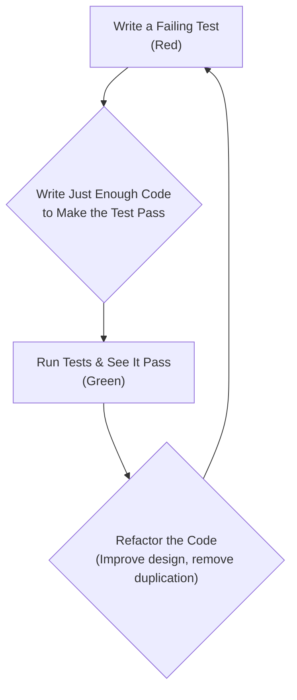
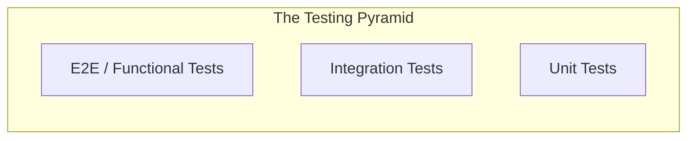
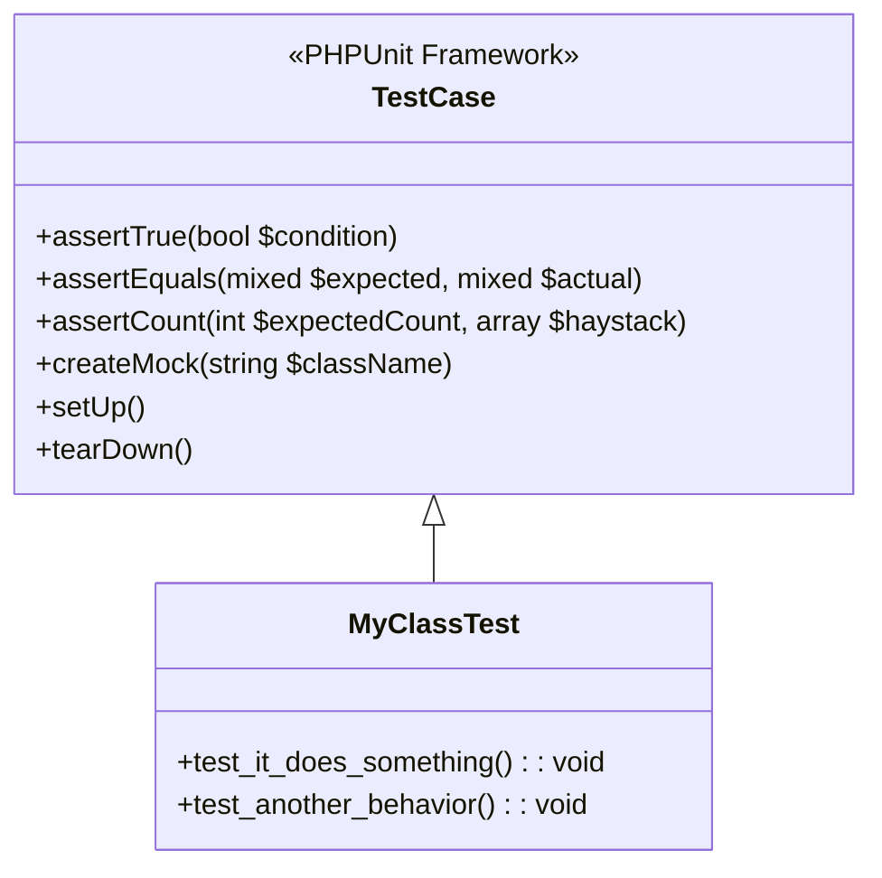
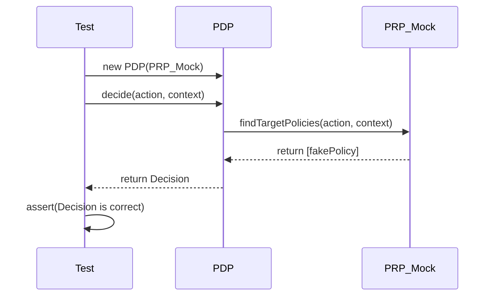
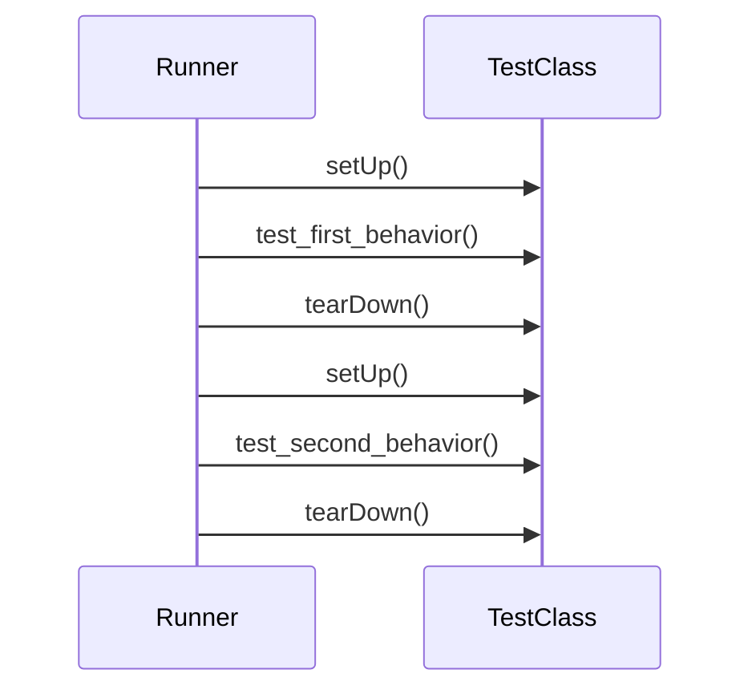
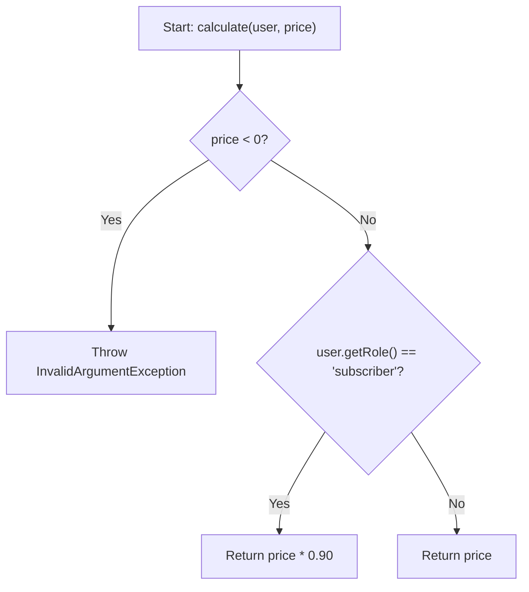

# A Guide to Modern PHP Testing

This document summarizes modern testing philosophies and practices, drawing from the principles outlined in "PHP: The Right Way" and Josh Lockhart's "Modern PHP". Its purpose is to serve as a comprehensive guide to writing effective automated tests for a PHP library or application.

## Table of Contents

- [1. The Philosophy of Testing](#1-the-philosophy-of-testing)
- [2. Core Testing Methodologies](#2-core-testing-methodologies)
- [3. The Testing Pyramid](#3-the-testing-pyramid)
- [4. Unit Testing with PHPUnit](#4-unit-testing-with-phpunit)
- [5. A Deeper Look at PHPUnit](#5-a-deeper-look-at-phpunit)
  - [PHPUnit and Composer](#phpunit-and-composer)
  - [Dissecting `phpunit.xml`](#dissecting-phpunitxml)
  - [The `TestCase` Class in Detail](#the-testcase-class-in-detail)
  - [Understanding PHPUnit's Output](#understanding-phpunits-output)
- [6. A Practical Guide to Writing Tests](#6-a-practical-guide-to-writing-tests)
  - [What Should I Test?](#what-should-i-test)
  - [Example: Testing a `DiscountCalculator`](#example-testing-a-discountcalculator)
- [7. Other Testing Frameworks & Tools](#7-other-testing-frameworks--tools)

---

## 1. The Philosophy of Testing

### Why We Test

As highlighted in "Modern PHP", testing is a critical, yet often neglected, part of professional software development. The primary goal of automated testing is **confidence**.

- **Confidence in Functionality:** Tests prove that your code works as you expect it to.
- **Confidence in Change:** A comprehensive test suite acts as a safety net, allowing you to refactor code or add new features without fear of breaking existing functionality. If the test suite passes, you can deploy with confidence.
- **Living Documentation:** Tests are practical, executable examples of how a piece of code is intended to be used.

### Overcoming Barriers to Testing

Developers often avoid testing because they perceive it as too time-consuming or are overwhelmed by the variety of tools. The key is to integrate testing as an essential part of the development workflow from the very beginning, not as an afterthought.

---

## 2. Core Testing Methodologies

"PHP: The Right Way" introduces two primary methodologies for how to approach testing.

### Test-Driven Development (TDD)

TDD is a development process that follows a short, repetitive cycle: "Red-Green-Refactor". The core principle is to **write a failing test before you write the application code**.



1.  **Red:** Write a simple, automated test for a new feature. Since the feature doesn't exist yet, the test will fail.
2.  **Green:** Write the absolute minimum amount of application code required to make the test pass.
3.  **Refactor:** With a passing test as a safety net, you can now clean up and improve the code you just wrote, confident that you haven't broken anything.

This cycle ensures you are always writing code for a specific, testable purpose.

### Behavior-Driven Development (BDD)

BDD is an evolution of TDD that focuses on describing the application's behavior from the user's perspective. It encourages collaboration between developers, QA, and non-technical stakeholders by using a natural, human-readable language called Gherkin.

Tests are written in a `Given / When / Then` format:

- **Given** some initial context (e.g., a user is logged in).
- **When** an event occurs (e.g., the user clicks the 'Logout' button).
- **Then** a specific outcome should be observed (e.g., the user is redirected to the homepage).

This "outside-in" approach focuses on application features rather than small, individual units of code.

---

## 3. The Testing Pyramid

The testing pyramid is a model for a balanced and effective testing strategy.



1.  **Unit Tests (The Foundation):** These make up the largest part of your test suite. They are fast, simple, and test a single class or method in complete isolation. Because they are fast, you can run them frequently.
2.  **Integration Tests (The Middle):** These test how different components of your system work together. For example, does your `PDP` correctly retrieve policies from your `PRP`? They are slower than unit tests because they involve more parts of the system.
3.  **Functional / End-to-End (E2E) Tests (The Peak):** These test the entire application from the user's perspective (e.g., simulating a browser click and asserting a change on the page). They are the slowest and most brittle, so they should be used sparingly for critical user workflows.

---

## 4. Unit Testing with PHPUnit

PHPUnit is the de-facto standard framework for writing unit tests in PHP. It provides the structure and tools needed to write and run tests effectively.

### Anatomy of a PHPUnit Test Case

A test class is a simple PHP class that extends `PHPUnit\Framework\TestCase`. This inheritance provides the assertion library and test running capabilities.



-   **Class Name:** Must end in `Test` (e.g., `UnaryExpressionTest`).
-   **Extends `TestCase`:** This provides access to all of PHPUnit's features.
-   **Test Methods:** Public methods prefixed with `test` (or using the `#[Test]` attribute in PHP 8+) are automatically run as individual tests.

### The "Arrange, Act, Assert" Pattern

Every test method should follow this clear, readable pattern:

```php
public function test_something_works(): void
{
    // 1. ARRANGE: Set up all objects, inputs, and mocks.
    $calculator = new Calculator();
    $inputA = 5;
    $inputB = 10;

    // 2. ACT: Execute the one method you are testing.
    $result = $calculator->add($inputA, $inputB);

    // 3. ASSERT: Check if the result is what you expected.
    $this->assertEquals(15, $result);
}
```

### Test Doubles: Mocks & Stubs

To achieve true isolation for a unit test, we use **Test Doubles** (often called **Mocks**). A mock is a fake object that we use in place of a real dependency.

For example, when testing the `PDP`, we don't want to test the real `PRP` and its file-reading logic. We want to test *only* the `PDP`'s decision logic. We can do this by giving the `PDP` a mock `PRP` that returns a predictable array of policies.



This sequence diagram shows the test controlling the `PRP_Mock`. The test ensures that the `PDP` receives a known, predictable input, so it can reliably assert that the `PDP`'s output is correct.

---

## 5. A Deeper Look at PHPUnit

### PHPUnit and Composer

PHPUnit is included in your `composer.json` file under the `require-dev` section. This means it is a **development dependency**—it's essential for building and testing the application, but it is not needed in a production environment and won't be installed if someone runs `composer install --no-dev`.

The executable that runs the tests is located at `./vendor/bin/phpunit`.

### Dissecting `phpunit.xml`

The `phpunit.xml` file is the configuration file for your test suite. Let's break down the key tags:

```xml
<phpunit
         bootstrap="vendor/autoload.php" <!-- 1 -->
         colors="true"                   <!-- 2 -->
         cacheDirectory=".phpunit.cache"> <!-- 3 -->
    <testsuites>
        <testsuite name="Unit">          <!-- 4 -->
            <directory>tests/Unit</directory>
        </testsuite>
    </testsuites>
    <source>
        <include>
            <directory>src</directory>    <!-- 5 -->
        </include>
    </source>
</phpunit>
```

1.  **`bootstrap`**: This is the most important attribute. It points to a PHP script that is executed before any tests are run. We point it to Composer's autoloader, which allows our tests to find and use our application classes.
2.  **`colors`**: Enables colored output (green for pass, red for fail) in the terminal for better readability.
3.  **`cacheDirectory`**: Specifies a location for PHPUnit to cache test results and analysis, which can speed up subsequent runs.
4.  **`<testsuite>`**: Defines a named group of tests. You can have multiple suites (e.g., "Unit" and "Integration"). This allows you to run only a specific group of tests via the command line: `phpunit --testsuite Unit`.
5.  **`<source>`**: This section is not for running tests, but for **code coverage analysis**. It tells PHPUnit which source code directories should be included when you generate a report to see what percentage of your code is covered by tests.

### The `TestCase` Class in Detail

As mentioned, `extends TestCase` gives your test class its power. Here are some of the most important features to utilize.

#### Lifecycle Methods: `setUp()` and `tearDown()`

These methods (also called "hooks") allow you to run code before and after each test method in a class.

- `protected function setUp(): void`: Runs **before** each test. It's perfect for creating a "fresh" instance of the object you are testing, ensuring that each test starts from a clean slate.
- `protected function tearDown(): void`: Runs **after** each test. It's useful for cleaning up resources, like deleting a file that was created during a test.



#### Data Providers

A Data Provider allows you to run the same test multiple times with different sets of data. This is incredibly efficient for testing many variations of an input.

```php
use PHPUnit\Framework\Attributes\DataProvider;

// ...

public static function additionProvider(): array
{
    return [
        '2 plus 2 is 4'  => [2, 2, 4],
        '0 plus 0 is 0'  => [0, 0, 0],
        '-1 plus 5 is 4' => [-1, 5, 4],
    ];
}

#[DataProvider('additionProvider')]
public function test_it_adds_numbers(int $a, int $b, int $expected): void
{
    // Arrange
    $calculator = new Calculator();

    // Act
    $result = $calculator->add($a, $b);

    // Assert
    $this->assertEquals($expected, $result);
}
```
This single test will run three times, once for each data set provided by `additionProvider`.

#### Common Assertion Methods

- **Equality:**
  - `assertEquals($expected, $actual)`: Checks if two values are equal (`==`).
  - `assertSame($expected, $actual)`: Checks if two values are identical (`===`), including type.
- **Boolean & Null:**
  - `assertTrue($condition)`
  - `assertFalse($condition)`
  - `assertNull($value)`
- **Arrays:**
  - `assertCount(3, $array)`: Checks if an array has a specific number of elements.
  - `assertArrayHasKey('user', $array)`
  - `assertContains('item', $array)`
- **Objects & Classes:**
  - `assertInstanceOf(User::class, $object)`
- **Exceptions:**
  - `expectException(InvalidArgumentException::class)`: Asserts that a specific exception is thrown during the "Act" phase.

### Understanding PHPUnit's Output

When you run `./vendor/bin/phpunit`, you will see a series of single-character indicators:

- **`.` (Dot):** A test passed successfully.
- **`F`**: A test **Failed**. This means one of your assertions (e.g., `assertEquals`) did not produce the expected result.
- **`E`**: An **Error** occurred. This is an unexpected PHP error, like a fatal error or an uncaught exception that you weren't testing for.
- **`S`**: A test was **Skipped**. You can intentionally skip tests (e.g., if a feature is not yet implemented) by calling `$this->markTestSkipped()`.
- **`I`**: A test was marked as **Incomplete**. This is for tests that are not yet fully written, using `$this->markTestIncomplete()`.

The final line will give you a summary, like `OK (15 tests, 42 assertions)` or `FAILURES! Tests: 10, Assertions: 23, Failures: 1, Errors: 1.`.

---

## 6. A Practical Guide to Writing Tests

### What Should I Test?

This is the most common question developers ask. The process is methodical:

1.  **One Test Class per Source Class:** For every class in your `src/` directory, you should have a corresponding test class in `tests/Unit/`. (e.g., `src/Support/AttributeAccessor.php` -> `tests/Unit/Support/AttributeAccessorTest.php`).

2.  **One Test Method per Behavior:** For each `public` method in your source class, identify its distinct behaviors or logical paths. You should write a separate test method for each one.

**How to identify behaviors:**
-   **The "Happy Path":** What happens when the method is given perfect, valid input?
-   **Invalid Input:** What happens if you pass `null`, a wrong type, or an empty string?
-   **Edge Cases:** What happens with `0`, `-1`, an empty array, or a very large number?
-   **Conditional Logic:** Every `if`/`else`/`switch` block represents at least two behaviors that need to be tested.
-   **Exceptions:** If a method is supposed to throw an exception under certain conditions, you must write a test that asserts the exception is thrown.

### Example: Testing a `DiscountCalculator`

Let's invent a simple new library class and write tests for it.

#### Step 1: The Class to be Tested

This class calculates a discount. Its logic has several paths we need to test.

**File: `src/SimpleExample/DiscountCalculator.php`**
```php
<?php
namespace mnaatjes\ABAC\SimpleExample;

use mnaatjes\ABAC\Tests\Stubs\User;

class DiscountCalculator
{
    /**
     * Calculates a final price after applying discounts.
     * - Throws an exception for negative prices.
     * - Applies a 10% discount for subscribers.
     */
    public function calculate(User $user, float $price): float
    {
        if ($price < 0) {
            throw new \InvalidArgumentException('Price cannot be negative.');
        }

        if ($user->getRole() === 'subscriber') {
            return $price * 0.90; // 10% discount
        }

        return $price; // No discount
    }
}
```

#### Step 2: Identifying the Test Cases

Looking at the `calculate` method, we can identify three distinct behaviors:
1.  It throws an exception if the price is negative.
2.  It applies a 10% discount if the user's role is 'subscriber'.
3.  It applies no discount if the user's role is not 'subscriber'.

This means we need **three** test methods.

#### Step 3: Writing the Test Class

We create a test class and write one method for each identified behavior.

**File: `tests/Unit/SimpleExample/DiscountCalculatorTest.php`**
```php
<?php
namespace mnaatjes\ABAC\Tests\Unit\SimpleExample;

use mnaatjes\ABAC\SimpleExample\DiscountCalculator;
use mnaatjes\ABAC\Tests\Stubs\User;
use PHPUnit\Framework\TestCase;

class DiscountCalculatorTest extends TestCase
{
    public function test_it_applies_no_discount_for_regular_user(): void
    {
        // Arrange
        $calculator = new DiscountCalculator();
        $user = new User('regular');

        // Act
        $finalPrice = $calculator->calculate($user, 100.0);

        // Assert
        $this->assertEquals(100.0, $finalPrice);
    }

    public function test_it_applies_subscriber_discount(): void
    {
        // Arrange
        $calculator = new DiscountCalculator();
        $user = new User('subscriber');

        // Act
        $finalPrice = $calculator->calculate($user, 100.0);

        // Assert
        $this->assertEquals(90.0, $finalPrice);
    }

    public function test_it_throws_exception_for_negative_price(): void
    {
        // Assert: Tell PHPUnit to expect this exception.
        $this->expectException(\InvalidArgumentException::class);

        // Arrange
        $calculator = new DiscountCalculator();
        $user = new User('regular');

        // Act: This line should trigger the exception.
        $calculator->calculate($user, -50.0);
    }
}
```

#### Step 4: Visualizing the Logic

This flowchart shows the logical paths inside the `calculate` method. Our three test methods successfully cover every possible path through the code.



---

## 7. Other Testing Frameworks & Tools

"PHP: The Right Way" also highlights other popular tools that complement or offer alternatives to PHPUnit.

### Behat (BDD)

Behat is the most popular BDD framework for PHP. You write your application's features in plain English using the Gherkin syntax (`.feature` files). Behat then parses these files and runs corresponding PHP code to test your application.

### phpspec (SpecBDD)

phpspec is a tool for Specification BDD. Instead of testing, you write *specifications* that describe how your objects *should* behave. phpspec then guides you through writing the code to meet those specifications. It's a powerful tool for designing clean, focused objects.

### Codeception

Codeception is a full-stack testing framework that builds on top of PHPUnit. It provides a unified and simplified syntax for writing unit, integration, and functional tests, making it a powerful all-in-one solution.