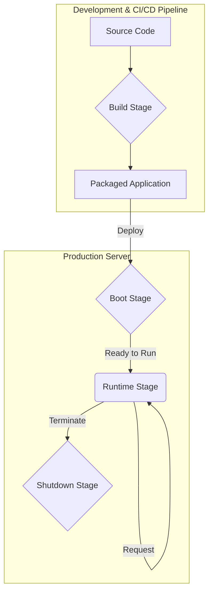

# Ref: The Application Lifecycle

This document explains the common lifecycle stages of a software application, from source code to a running process, and places the components of this ABAC library within that lifecycle.

Understanding these stages is crucial for knowing *where* and *when* certain actions (like reading configuration) should happen.

## The Four Main Stages

A typical application lifecycle can be broken down into four distinct stages: Build, Boot, Runtime, and Shutdown.



---

### 1. The Build Stage

*   **When does it happen?** Before the application is deployed. This happens on a developer's machine or, more formally, in a Continuous Integration (CI) pipeline.
*   **What is its goal?** To take the raw source code and create a stable, distributable package that is ready for deployment. All dependencies are fetched and locked at this stage.
*   **Common Activities:**
    *   Installing dependencies (e.g., `composer install`).
    *   Running linters and static analysis.
    *   Executing automated unit tests.
    *   Compiling or transpiling assets (e.g., TypeScript to JavaScript).
*   **ABAC Example:** The `composer install` command reads your `composer.json`, downloads all the required libraries (like `psr/log`), and generates the autoloader. This is a classic build-time action.

---

### 2. The Boot Stage

*   **When does it happen?** Once, when the application first starts on the server, right before it is ready to handle requests.
*   **What is its goal?** To initialize the application's state, load configuration, and prepare all necessary services. This is the "warming up" or "power-on self-test" phase.
*   **Common Activities:**
    *   Loading environment variables (`.env`).
    *   Reading and parsing configuration files.
    *   Setting up the dependency injection container.
    *   Establishing database connections.
    *   Warming up caches.
*   **ABAC Example:** This is where your `ABACFactory` runs. It reads your `policies.json` file, constructs the `PolicyRepository`, `PRP`, `PDP`, and `PEP` objects, and wires them all together. After the boot stage, a fully configured `PEP` service is ready to be used.

    ```php
    // This is BOOT-TIME code, likely in a service provider or bootstrap file.

    // The factory handles all the complex setup.
    $pep = \mnaatjes\ABAC\ABACFactory::createJsonFileService(__DIR__ . '/config/policies.json');

    // The resulting $pep object is registered as a singleton
    // in the application's service container, ready for runtime.
    $container->set('abac_pep', $pep);
    ```

---

### 3. The Runtime Stage

*   **When does it happen?** This is the main, active phase while the application is running and responding to live requests or events.
*   **What is its goal?** To execute the application's core business logic in response to specific inputs.
*   **Common Activities:**
    *   Handling an incoming HTTP request.
    *   Processing a job from a queue.
    *   Executing a command-line script.
    *   Making authorization decisions.
*   **ABAC Example:** A user sends a `POST` request to `/posts/123`. The application's router calls a controller method. Inside the controller, the `PEP` is used to check if the user is allowed to perform the action. This is a pure runtime operation.

    ```php
    // This is RUNTIME code, inside a controller that handles a live request.

    class PostController
    {
        private PEP $pep;

        // The $pep is injected; it was created during the BOOT stage.
        public function __construct(PEP $pep)
        {
            $this->pep = $pep;
        }

        public function update(Request $request, Post $post)
        {
            // 1. Get the live actor and subject from the request.
            $actor = $request->user();

            // 2. Assemble the PolicyContext for this specific request.
            $context = new PolicyContext($actor, [$post]);

            // 3. Enforce the policy. This is the core runtime check.
            $this->pep->enforce('update-post', $context);

            // 4. If we get here, the action was allowed. Proceed with business logic.
            $post->update($request->all());
            return new JsonResponse(['message' => 'Post updated.']);
        }
    }
    ```

---

### 4. The Shutdown Stage

*   **When does it happen?** When the application is gracefully terminating (e.g., after a script finishes or a server process is told to stop).
*   **What is its goal?** To ensure a clean exit without losing data.
*   **Common Activities:**
    *   Closing all database connections.
    *   Flushing any remaining data from caches to disk.
    *   Logging final messages.
    *   Sending notifications that the process has ended.
*   **ABAC Example:** This stage is less relevant for the ABAC library itself, which is mostly stateless at runtime. However, the larger application using the library would perform its shutdown tasks, like closing the database connection that the `PolicyRepository` might have been using.

### Summary

| Stage | Key Question | ABAC System Example |
| :--- | :--- | :--- |
| **Build** | How do I prepare my code for deployment? | `composer install` fetches dependencies. |
| **Boot** | How do I initialize my application to be ready? | `ABACFactory` reads `policies.json` and builds the `PEP` service. |
| **Runtime** | How do I handle a specific request? | The `PEP`'s `enforce()` method is called to authorize an action. |
| **Shutdown**| How do I stop gracefully? | The application closes the database connection the `PolicyRepository` might use. |
