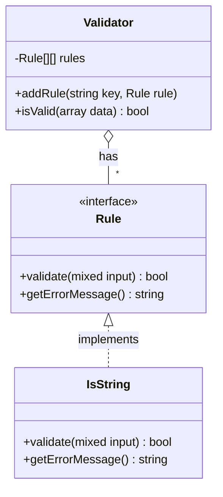
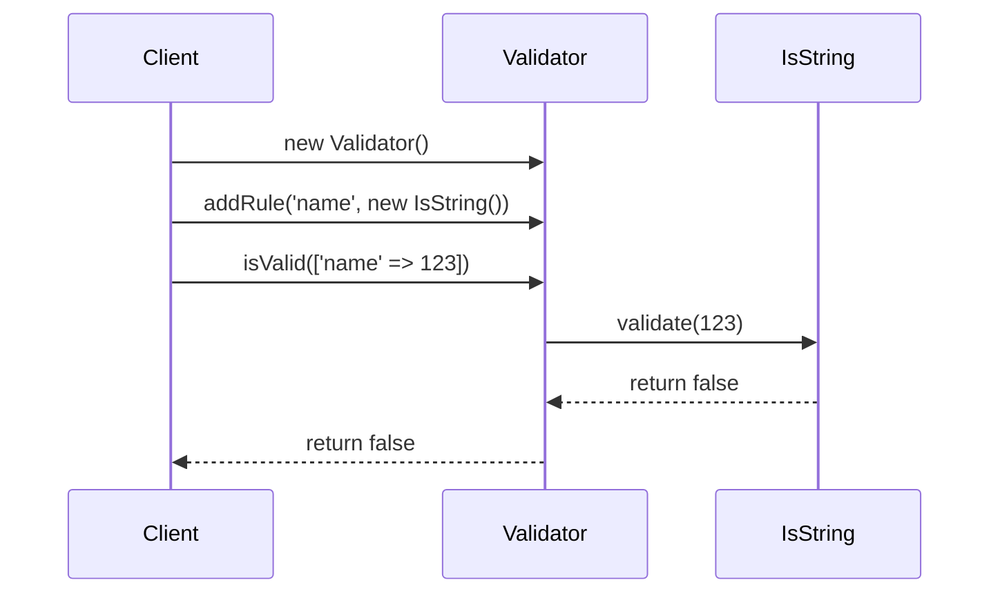

# Reference: Schema Validation Libraries

This document explains the purpose and structure of a schema validation library.

### What it is and what it does

A Schema Definition Library is a specialized tool designed for one primary purpose: **to define a set of rules for your data's structure and content, and then validate your data against those rules.**

Think of it as a blueprint and an inspector for your data.
1.  **The Blueprint (Schema Definition):** You use the library's tools to create a "blueprint" (a schema object) that describes exactly what your data should look like. For example, "the `email` field must be a valid email address," or "the `tags` field must be an array of strings."
2.  **The Inspector (Validation):** You then hand the library your actual data and the blueprint. The library acts as an inspector, comparing the data to the blueprint. It then gives you a simple pass/fail result, often with a detailed list of any violations.

This **separates the rules from the logic**. Your application code doesn't need to be littered with `if (isset($data['key']))` checks. It just asks the library, "Does this data conform to the `UserSchema`?"

### Sketch of a Simple Library

To understand the internal structure, we can imagine a simple library with two core components: a `Rule` interface and a `Validator` class that consumes them.

```php
/**
 * The contract for any validation rule.
 */
interface Rule
{
    /** Checks if the input is valid according to this rule. */
    public function validate(mixed $input): bool;

    /** The error message if validation fails. */
    public function getErrorMessage(): string;
}

// --- An example of a concrete rule ---
class IsString implements Rule
{
    public function validate(mixed $input): bool
    {
        return is_string($input);
    }

    public function getErrorMessage(): string
    {
        return 'This value must be a string.';
    }
}

/**
 * The main Validator class that uses the rules.
 */
class Validator
{
    private array $rules = [];
    private array $errors = [];

    /** Attaches a rule to a specific key in the data array. */
    public function addRule(string $key, Rule $rule): self
    {
        $this->rules[$key][] = $rule;
        return $this; // Allows for method chaining
    }

    /** Validates the data against all attached rules. */
    public function isValid(array $data): bool
    {
        $this->errors = []; // Reset errors

        foreach ($this->rules as $key => $rulesForKey) {
            if (!array_key_exists($key, $data)) {
                $this->errors[$key][] = "The key '{$key}' is missing.";
                continue;
            }

            foreach ($rulesForKey as $rule) {
                if (!$rule->validate($data[$key])) {
                    $this->errors[$key][] = $rule->getErrorMessage();
                }
            }
        }

        return empty($this->errors);
    }

    public function getErrors(): array
    {
        return $this->errors;
    }
}
```

### Diagrams

**Class Diagram**

This diagram shows the relationship between the `Validator`, the `Rule` interface, and a concrete implementation.



**Sequence Diagram**

This diagram shows the sequence of calls during a validation process.



# Pipe Rule Syntax
```php
$rules = [
    'email' => 'required|email|max:255|unique:users'
    ];

```

## What it is

Instead of chaining multiple methods or creating complex rule objects, you define the rules as a simple string where each instruction is separated by a delimiter, most commonly a pipe (|). Many rules can also accept parameters, which are usually separated by a colon (:).

This approach is heavily used in many PHP frameworks, most notably Laravel.

Classic Example: User Registration
Imagine you're validating a new user's email address. The rules might be:

It must be provided (required).

It must be a valid email format (email).

It must not be longer than 255 characters (max:255).

It must be unique in the users database table (unique:users).

## How It Works Internally

Under the hood, the validator performs a simple parsing routine:

Split the String: The validator takes the full rule string (e.g., 'required|max:255') and splits it by the pipe (|) delimiter into an array of individual rules: ['required', 'max:255'].

Parse Parameters: It then iterates through each rule. If a rule contains a colon (:), it splits it again to separate the rule name from its parameters.

'required' becomes ruleName = 'required', params = [].

'max:255' becomes ruleName = 'max', params = ['255'].

Execute Rule: The validator then calls an internal method corresponding to the rule name (e.g., validateMax()) and passes the candidate value and the parsed parameters to it.

Aggregate Results: The validator continues executing rules until one fails (if it's set to "fail fast") or until all rules have been checked, collecting any error messages along the way.

The same principle applies to sanitation. A string like 'trim|strip_tags|escape' would cause the validator to sequentially apply the trim(), strip_tags(), and HTML escaping functions to the input data.

## Implementation

```php
<?php

class SimpleValidator
{
    /**
         * @var array Holds any validation error messages.
              */
                  protected array $errors = [];
                  
                      /**
                           * @var array The data being validated (e.g., $_POST).
                                */
                                    protected array $data = [];
                                    
                                        /**
                                             * Validates the given data against a set of rules.
                                                  *
                                                       * @param array $data The input data to validate.
                                                            * @param array $rules An associative array of field names and their rule strings.
                                                                 * @return bool True if validation passes, false otherwise.
                                                                      */
                                                                          public function validate(array $data, array $rules): bool
                                                                              {
                                                                                      $this->errors = [];
                                                                                              $this->data = $data;

                                                                                                      // 1. Loop through each field and its associated rule string.
                                                                                                              foreach ($rules as $field => $ruleString) {
                                                                                                                          $value = $this->data[$field] ?? null;

                                                                                                                                      // 2. Split the rule string into individual rules (e.g., 'required|email').
                                                                                                                                                  $individualRules = explode('|', $ruleString);

                                                                                                                                                              // 3. Process each individual rule for the field.
                                                                                                                                                                          foreach ($individualRules as $rule) {
                                                                                                                                                                                          $this->applyRule($field, $value, $rule);
                                                                                                                                                                                                      }
                                                                                                                                                                                                              }

                                                                                                                                                                                                                      return empty($this->errors);
                                                                                                                                                                                                                          }

                                                                                                                                                                                                                              /**
                                                                                                                                                                                                                                   * Parses a rule and calls the corresponding validation method.
                                                                                                                                                                                                                                        *
                                                                                                                                                                                                                                             * @param string $field The name of the field.
                                                                                                                                                                                                                                                  * @param mixed $value The value of the field.
                                                                                                                                                                                                                                                       * @param string $rule The specific rule to apply (e.g., 'max:255').
                                                                                                                                                                                                                                                            */
                                                                                                                                                                                                                                                                protected function applyRule(string $field, mixed $value, string $rule): void
                                                                                                                                                                                                                                                                    {
                                                                                                                                                                                                                                                                            $methodName = 'validate';
                                                                                                                                                                                                                                                                                    $parameters = [];

                                                                                                                                                                                                                                                                                            // 4. Check for parameters (like the '255' in 'max:255').
                                                                                                                                                                                                                                                                                                    if (str_contains($rule, ':')) {
                                                                                                                                                                                                                                                                                                                [$ruleName, $paramString] = explode(':', $rule, 2);
                                                                                                                                                                                                                                                                                                                            $parameters = explode(',', $paramString);
                                                                                                                                                                                                                                                                                                                                        // Convert 'Max' to 'validateMax'
                                                                                                                                                                                                                                                                                                                                                    $methodName .= ucfirst($ruleName);
                                                                                                                                                                                                                                                                                                                                                            } else {
                                                                                                                                                                                                                                                                                                                                                                        // Convert 'required' to 'validateRequired'
                                                                                                                                                                                                                                                                                                                                                                                    $methodName .= ucfirst($rule);
                                                                                                                                                                                                                                                                                                                                                                                            }

                                                                                                                                                                                                                                                                                                                                                                                                    // 5. Call the specific validation method if it exists.
                                                                                                                                                                                                                                                                                                                                                                                                            if (method_exists($this, $methodName)) {
                                                                                                                                                                                                                                                                                                                                                                                                                        $this->$methodName($field, $value, $parameters);
                                                                                                                                                                                                                                                                                                                                                                                                                                }
                                                                                                                                                                                                                                                                                                                                                                                                                                    }

                                                                                                                                                                                                                                                                                                                                                                                                                                        /**
                                                                                                                                                                                                                                                                                                                                                                                                                                             * Returns all validation errors.
                                                                                                                                                                                                                                                                                                                                                                                                                                                  */
                                                                                                                                                                                                                                                                                                                                                                                                                                                      public function getErrors(): array
                                                                                                                                                                                                                                                                                                                                                                                                                                                          {
                                                                                                                                                                                                                                                                                                                                                                                                                                                                  return $this->errors;
                                                                                                                                                                                                                                                                                                                                                                                                                                                                      }

                                                                                                                                                                                                                                                                                                                                                                                                                                                                          // --- SPECIFIC VALIDATION RULE METHODS ---

                                                                                                                                                                                                                                                                                                                                                                                                                                                                              protected function validateRequired(string $field, mixed $value): void
                                                                                                                                                                                                                                                                                                                                                                                                                                                                                  {
                                                                                                                                                                                                                                                                                                                                                                                                                                                                                          if (empty($value)) {
                                                                                                                                                                                                                                                                                                                                                                                                                                                                                                      $this->errors[$field][] = "The {$field} field is required.";
                                                                                                                                                                                                                                                                                                                                                                                                                                                                                                              }
                                                                                                                                                                                                                                                                                                                                                                                                                                                                                                                  }

                                                                                                                                                                                                                                                                                                                                                                                                                                                                                                                      protected function validateEmail(string $field, mixed $value): void
                                                                                                                                                                                                                                                                                                                                                                                                                                                                                                                          {
                                                                                                                                                                                                                                                                                                                                                                                                                                                                                                                                  if (!filter_var($value, FILTER_VALIDATE_EMAIL)) {
                                                                                                                                                                                                                                                                                                                                                                                                                                                                                                                                              $this->errors[$field][] = "The {$field} must be a valid email address.";
                                                                                                                                                                                                                                                                                                                                                                                                                                                                                                                                                      }
                                                                                                                                                                                                                                                                                                                                                                                                                                                                                                                                                          }

                                                                                                                                                                                                                                                                                                                                                                                                                                                                                                                                                              protected function validateMax(string $field, mixed $value, array $params): void
                                                                                                                                                                                                                                                                                                                                                                                                                                                                                                                                                                  {
                                                                                                                                                                                                                                                                                                                                                                                                                                                                                                                                                                          $maxLength = (int) ($params[0] ?? 0);
                                                                                                                                                                                                                                                                                                                                                                                                                                                                                                                                                                                  if (strlen($value) > $maxLength) {
                                                                                                                                                                                                                                                                                                                                                                                                                                                                                                                                                                                              $this->errors[$field][] = "The {$field} must not be greater than {$maxLength} characters.";
                                                                                                                                                                                                                                                                                                                                                                                                                                                                                                                                                                                                      }
                                                                                                                                                                                                                                                                                                                                                                                                                                                                                                                                                                                                          }
                                                                                                                                                                                                                                                                                                                                                                                                                                                                                                                                                                                                          }
```