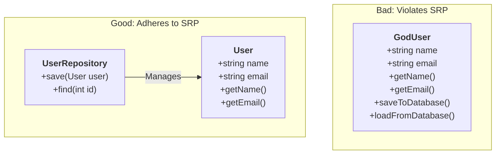
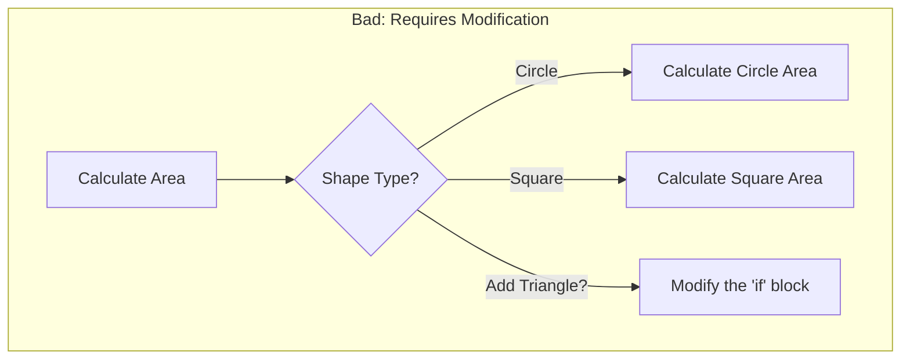
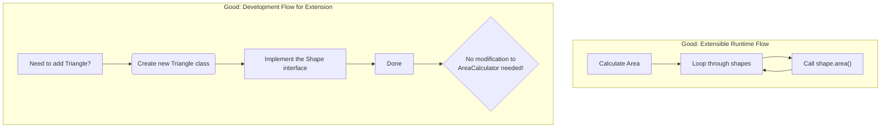
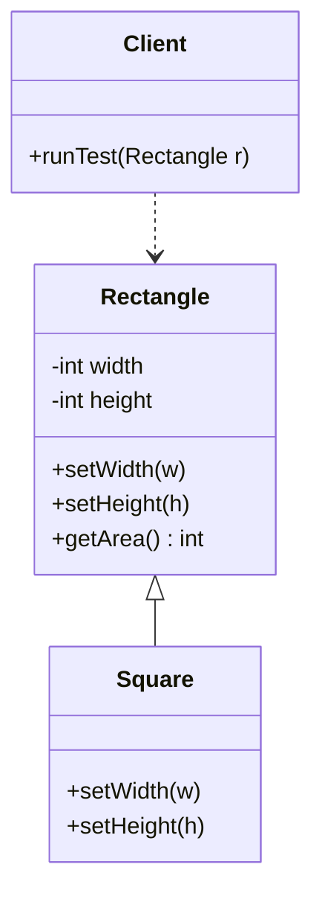
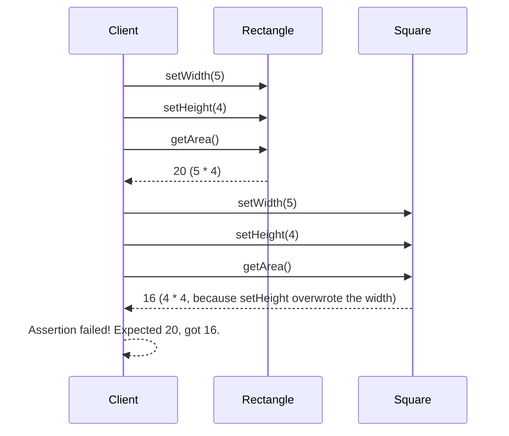
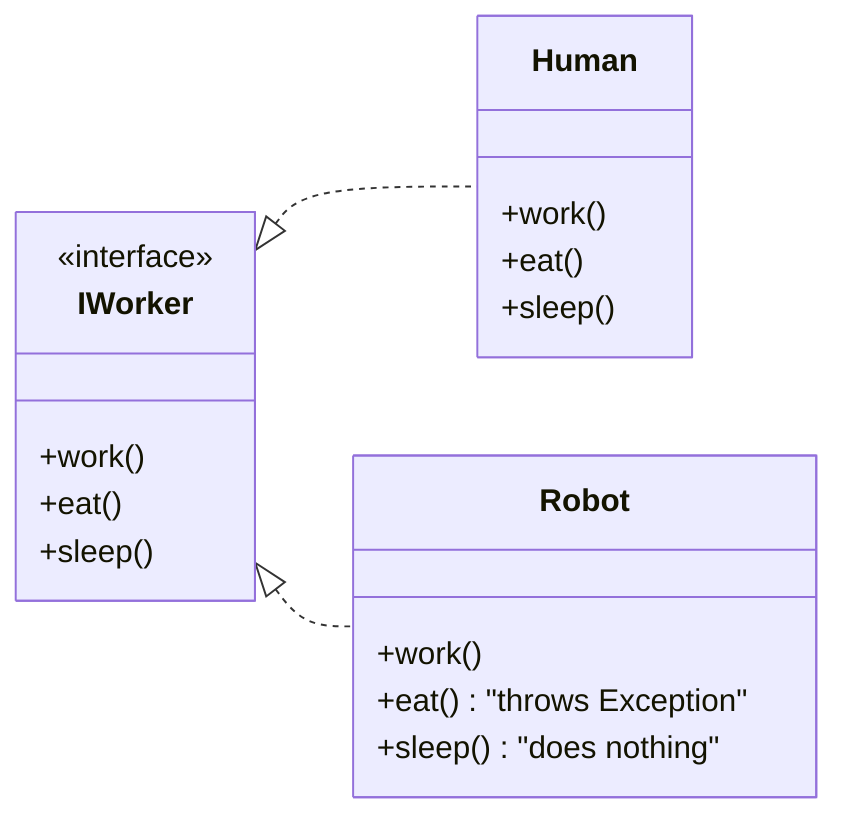
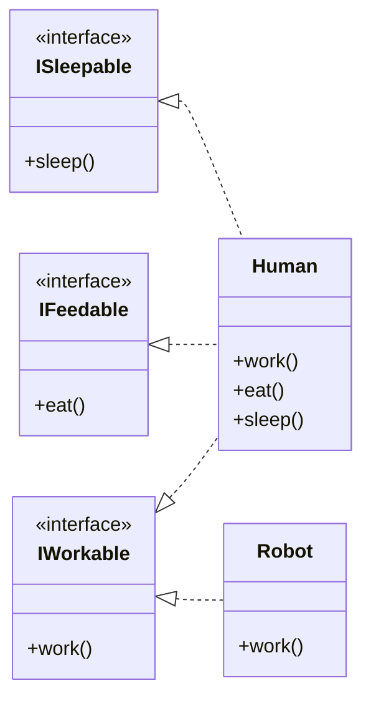
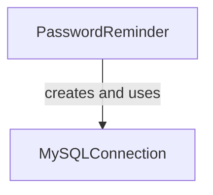
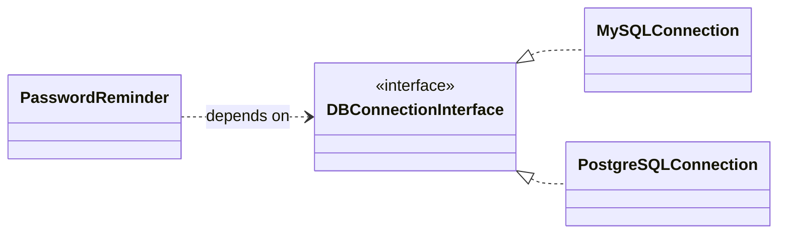

# An Overview of SOLID Principles

**SOLID** is a mnemonic acronym for five fundamental principles of object-oriented programming and design. These guidelines help developers create software that is more understandable, flexible, and maintainable. When applied together, they make it easier to manage complexity, refactor code, and avoid common pitfalls in software development.

The principles were promoted by Robert C. Martin (often called "Uncle Bob").

The five SOLID principles are:

1.  **S** – [Single Responsibility Principle (SRP)](#s--single-responsibility-principle-srp)
2.  **O** – [Open/Closed Principle (OCP)](#o--openclosed-principle-ocp)
3.  **L** – [Liskov Substitution Principle (LSP)](#l--liskov-substitution-principle-lsp)
4.  **I** – [Interface Segregation Principle (ISP)](#i--interface-segregation-principle-isp)
5.  **D** – [Dependency Inversion Principle (DIP)](#d--dependency-inversion-principle-dip)

---

## S – Single Responsibility Principle (SRP)

> **The Idea:** A class should have only one reason to change.

This means that a class should have one, and only one, job or responsibility. If a class has more than one responsibility, those responsibilities become coupled. A change to one responsibility can lead to unintended changes in the other.

### Common Identifiers & Analogies
*   **Separation of Concerns:** The most common phrase associated with SRP.
*   **God Object:** A class that violates SRP by doing too many things.
*   **The Swiss Army Knife (Bad) vs. The Chef's Knife (Good):** A Swiss Army knife does many things poorly. A chef's knife does one thing (cutting) exceptionally well.
*   **The Restaurant Analogy:** A chef cooks, a waiter serves, and a cashier handles payments. You don't want one person doing all three jobs; it's inefficient and error-prone.

### Diagrams

#### Class Diagram: Violation vs. Adherence

This diagram shows a "God Object" `User` that handles both data and persistence, and the corrected version where persistence logic is moved to a dedicated `UserRepository`.



### PHP Code Examples

#### Bad: Violates SRP
This `User` class is responsible for both managing user properties and handling its own database storage. A change in the database schema would require a change in this class, as would a change in user business logic.

```php
<?php
class User
{
    private $pdo;

    public function __construct(
        public string $name,
        public string $email
    ) {
        $this->pdo = new PDO("mysql:host=localhost;dbname=db", "user", "pass");
    }

    public function getName(): string
    {
        return $this->name;
    }

    // This method is a separate responsibility (persistence)
    public function save(): void
    {
        $stmt = $this->pdo->prepare("INSERT INTO users (name, email) VALUES (?, ?)");
        $stmt->execute([$this->name, $this->email]);
    }
}
```

#### Good: Adheres to SRP
Here, the responsibilities are separated. The `User` class only manages user data, and the `UserRepository` only manages persistence.

```php
<?php
// Responsibility 1: Hold user data
class User
{
    public function __construct(
        public string $name,
        public string $email
    ) {}
}

// Responsibility 2: Persist user data
class UserRepository
{
    private $pdo;

    public function __construct(PDO $pdo)
    {
        $this->pdo = $pdo;
    }

    public function save(User $user): void
    {
        $stmt = $this->pdo->prepare("INSERT INTO users (name, email) VALUES (?, ?)");
        $stmt->execute([$user->name, $user->email]);
    }
}
```

---

## O – Open/Closed Principle (OCP)

> **The Idea:** Software entities (classes, modules, functions) should be open for extension, but closed for modification.

This means you should be able to add new functionality without changing existing, proven code. This is typically achieved by using interfaces, abstract classes, and polymorphism.

### Common Identifiers & Analogies
*   **Plugin Architecture:** The core idea behind OCP. The main application is closed, but you can extend it with plugins.
*   **Strategy Pattern:** A classic implementation of OCP.
*   **The Laptop Analogy:** A laptop is closed (you can't change its motherboard), but it's open to extension via USB ports (you can add a keyboard, mouse, etc.).

### Diagrams

#### Flowchart: Violation vs. Adherence

This shows how a rigid `if/else` block requires modification for new features, while a polymorphic approach allows extension without modification.





### PHP Code Examples

#### Bad: Violates OCP
To add a `Triangle` shape, you must modify the `calculateArea` method in the `AreaCalculator` class. This risks introducing bugs into existing, working logic.

```php
<?php
class Circle { public $radius; }
class Square { public $side; }

class AreaCalculator
{
    public function calculateArea(array $shapes): float
    {
        $area = 0;
        foreach ($shapes as $shape) {
            if ($shape instanceof Circle) {
                $area += pi() * $shape->radius * $shape->radius;
            } elseif ($shape instanceof Square) {
                $area += $shape->side * $shape->side;
            }
            // To add a Triangle, I MUST EDIT THIS FILE!
        }
        return $area;
    }
}
```

#### Good: Adheres to OCP
By introducing a `Shape` interface, the `AreaCalculator` no longer needs to know about concrete shapes. To add a `Triangle`, you simply create a new class that implements the interface. The `AreaCalculator` remains untouched.

```php
<?php
interface Shape
{
    public function area(): float;
}

class Circle implements Shape
{
    public function __construct(public float $radius) {}
    public function area(): float { return pi() * $this->radius * $this->radius; }
}

class Square implements Shape
{
    public function __construct(public float $side) {}
    public function area(): float { return $this->side * $this->side; }
}

// To add a new shape, I create a new file. No existing code is modified.
class Triangle implements Shape
{
    public function __construct(public float $base, public float $height) {}
    public function area(): float { return 0.5 * $this->base * $this->height; }
}

class AreaCalculator
{
    public function calculateArea(array $shapes): float
    {
        $area = 0;
        foreach ($shapes as $shape) {
            // No modification needed here, ever.
            $area += $shape->area();
        }
        return $area;
    }
}
```

---

## L – Liskov Substitution Principle (LSP)

> **The Idea:** Subtypes must be substitutable for their base types without altering the correctness of the program.

This means that if a class `B` is a subtype of class `A`, you should be able to replace an object of `A` with an object of `B` without breaking the application. Subclasses should extend the functionality of their parent class, not narrow it.

### Common Identifiers & Analogies
*   **"Is-a" relationship:** A subclass should have a true "is-a" relationship with its parent.
*   **The Penguin Problem:** A `Penguin` "is-a" `Bird`, but it can't `fly()`. If your `Bird` base class has a `fly()` method, `Penguin` is not a substitutable subtype.
*   **The Remote Control Analogy:** A `SmartTV` remote should be able to do everything a basic `TV` remote can. If the `SmartTV` remote's volume button doesn't work, it violates LSP.

### Diagrams

#### Class Diagram: The Classic `Rectangle`/`Square` Problem

This diagram shows a common LSP violation. A `Square` "is-a" `Rectangle` mathematically, but not behaviorally in code if the `Rectangle` has separate `setWidth` and `setHeight` methods.



#### Sequence Diagram: How the Violation Occurs

The client expects setting the width and height to be independent operations. For a `Square`, they are not, which breaks the client's expectation.



### PHP Code Examples

#### Bad: Violates LSP
The `Square` class changes its width when its height is set (and vice-versa), which is not the behavior of the parent `Rectangle` class.

```php
<?php
class Rectangle
{
    public function __construct(protected int $width, protected int $height) {}

    public function setWidth(int $width): void { $this->width = $width; }
    public function setHeight(int $height): void { $this->height = $height; }
    public function getArea(): int { return $this->width * $this->height; }
}

class Square extends Rectangle
{
    public function __construct(int $side) { parent::__construct($side, $side); }

    // This behavior is different from the parent
    public function setWidth(int $width): void
    {
        $this->width = $width;
        $this->height = $width;
    }

    // This one is also different
    public function setHeight(int $height): void
    {
        $this->width = $height;
        $this->height = $height;
    }
}

function runClientCode(Rectangle $r)
{
    $r->setWidth(5);
    $r->setHeight(4);
    assert($r->getArea() === 20, "Area should be 20!"); // This will fail for a Square
}

runClientCode(new Square(1)); // Throws an assertion error
```

#### Good: Adheres to LSP (by changing the model)
The best solution is often to avoid the inheritance altogether if the behavior doesn't match. Favor composition or use a shared interface.

```php
<?php
interface Shape {
    public function getArea(): int;
}

class Rectangle implements Shape {
    // ... same as before
}

class Square implements Shape {
    public function __construct(private int $side) {}
    public function getArea(): int { return $this->side * $this->side; }
}
// Now there is no inheritance and no violation of expectations.
```

---

## I – Interface Segregation Principle (ISP)

> **The Idea:** No client should be forced to depend on methods it does not use. It's better to have many small, specific interfaces than one large, general-purpose one.

This principle is about breaking down "fat" interfaces into smaller, more focused ones called "Role Interfaces."

### Common Identifiers & Analogies
*   **Role Interfaces:** The name for the smaller, more specific interfaces.
*   **Fat Interfaces:** The anti-pattern that ISP addresses.
*   **The Restaurant Menu Analogy:** You want a menu for the specific restaurant you're in, not a giant book of every food item in the world.

### Diagrams

#### Class Diagram: Violation vs. Adherence

This shows a "fat" `IWorker` interface that forces a `Robot` to have an `eat()` method, and the corrected version with smaller, segregated interfaces.

<br/>

**Violation Example**


**Adherence Example**


### PHP Code Examples

#### Bad: Violates ISP
The `Robot` is forced to implement `eat()` and `sleep()`, which have no meaning for it. This can lead to empty methods or methods that throw exceptions.

```php
<?php
interface Worker
{
    public function work(): void;
    public function eat(): void;
    public function sleep(): void;
}

class Human implements Worker {
    public function work(): void { /* works */ }
    public function eat(): void { /* eats */ }
    public function sleep(): void { /* sleeps */ }
}

class Robot implements Worker {
    public function work(): void { /* works hard */ }
    
    // This method is meaningless for a Robot
    public function eat(): void {
        throw new Exception("Robots don't eat!");
    }
    
    // This one is also forced upon the class
    public function sleep(): void {
        // Do nothing
    }
}
```

#### Good: Adheres to ISP
By splitting the interface, classes only implement the behaviors they actually have.

```php
<?php
interface Workable { public function work(): void; }
interface Feedable { public function eat(): void; }
interface Sleepable { public function sleep(): void; }

class Human implements Workable, Feedable, Sleepable {
    public function work(): void { /* works */ }
    public function eat(): void { /* eats */ }
    public function sleep(): void { /* sleeps */ }
}

// The Robot only implements the interface it needs.
class Robot implements Workable {
    public function work(): void { /* works hard */ }
}
```

---

## D – Dependency Inversion Principle (DIP)

> **The Idea:** High-level modules should not depend on low-level modules. Both should depend on abstractions. Furthermore, abstractions should not depend on details; details should depend on abstractions.

This principle encourages loose coupling by ensuring that high-level policy-setting code is not dependent on low-level implementation details. This is often achieved through **Dependency Injection**.

### Common Identifiers & Analogies
*   **Inversion of Control (IoC):** A broader concept that DIP is a key part of.
*   **Dependency Injection (DI):** A common technique for implementing DIP.
*   **The Lamp and Socket Analogy:** A lamp (high-level) doesn't know about the wiring in the wall (low-level). Both depend on a standard interface: the socket. This allows you to plug any lamp into any socket.

### Diagrams

#### Class Diagram: Violation vs. Adherence

This shows a high-level `PasswordReminder` directly creating a low-level `MySQLConnection`, making it rigid. The corrected version depends on an interface, `DBConnectionInterface`, which is "injected" into it.

<br/>

**Violation Example**


**Adherence Example**


### PHP Code Examples

#### Bad: Violates DIP
The `PasswordReminder` is tightly coupled to `MySQLConnection`. If you want to switch to PostgreSQL, you have to modify the `PasswordReminder` class.

```php
<?php
class MySQLConnection
{
    public function connect() { /* ... */ }
}

class PasswordReminder
{
    private $dbConnection;

    public function __construct()
    {
        // The high-level class is directly creating a low-level object.
        $this->dbConnection = new MySQLConnection();
    }
}
```

#### Good: Adheres to DIP
The `PasswordReminder` now depends on an abstraction (`DBConnectionInterface`). You can pass in *any* object that implements this interface. This "inverts" the dependency—the control of which database to use is now outside the `PasswordReminder` class.

```php
<?php
interface DBConnectionInterface
{
    public function connect();
}

class MySQLConnection implements DBConnectionInterface
{
    public function connect() { /* connect to MySQL */ }
}

class PostgreSQLConnection implements DBConnectionInterface
{
    public function connect() { /* connect to PostgreSQL */ }
}

class PasswordReminder
{
    private $dbConnection;

    // The dependency is "injected" via the constructor.
    public function __construct(DBConnectionInterface $dbConnection)
    {
        $this->dbConnection = $dbConnection;
    }
}

// Client code decides which implementation to use:
$mysql = new MySQLConnection();
$reminder = new PasswordReminder($mysql);

// Or switch easily:
$postgres = new PostgreSQLConnection();
$reminder = new PasswordReminder($postgres);
```
